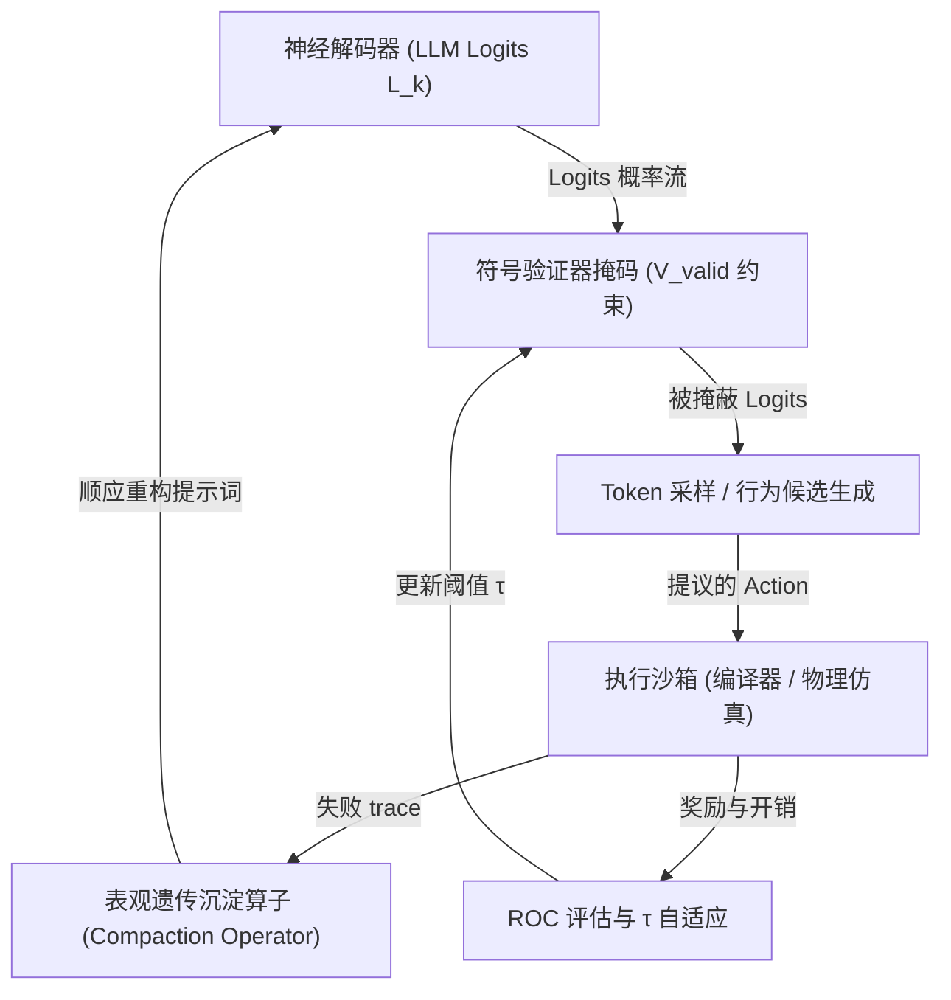

# 智能体具象化：信息边界与持久化 Agent IP

**刘腾蛟 (LIU TENGJIAO)**  
*创始人兼研究员, psi.run*  
psi@psi.run  

**司宏宗 (Hongzong Si)**  
*教授, 青岛大学*  
sihz@qdu.edu.cn  

> **创始人白皮书 (Founder Whitepaper) / 主张性论文 (Position Paper)**  
> **Design & Engineering Philosophy**：本白皮书阐述了经验性多智能体运行环境中智能体具象化（Agent Concretization）的概念基础。本版本（v2）正式引入了**图式沙箱（Schema Sandbox）**作为核心的 neuro-symbolic 认知约束边界，融入了 2025-2026 年全球前沿建构主义 AI 领域的最新学术进展，并推导了认知熵减与物理具身智能（Spatial Intelligence）的工程映射。

---

## 摘要 (Abstract)

这是一篇立场论文（Position Paper），提出了一种源自工程实践的理论框架。我们在此分享早期实证观察，而非宣称最终的实验验证。预训练大语言模型具有良好的泛化能力，然而由于缺乏稳定边界，在长周期任务中严重漂移。我们引入《智能体具象化》（Agent Concretization）——一个直接将低维信息边界施加于模型隐空间的框架。该边界作为 Token 生成 logits 的神经符号过滤器，将无状态、耗散的概率场转变为能随时间累积身份、技能和声誉的持久 Agent IP。简单的二维随机游走仿真表明，这种空间约束能显著稳定长周期行为。我们还描述了图式沙箱的具体实现，将其规格化为兼容 HuggingFace Transformers 和 vLLM 的 LogitsProcessor。实证验证正在进行中。

## 一、 问题定义 (Problem): 隐空间海洋与泛化者困境

在2026年初，我创建了 psi.run，一个旨在提供持久化智能体身份的平台。在部署的第一周内，我观察到了学术论文未曾提及的现象：即使配备了最先进的记忆系统，智能体在运行数小时后仍会偏离主线。常规的诊断——‘记忆容量不足’——并不成立。智能体记住了我们要求它们记住的一切。问题不在于召回（Recall），而在于连贯性（Coherence）。根本原因不是记忆不足，而是缺乏主动边界。这带来了两个根本性缺陷：

1.  **底座模型在模型层面上是无状态的 (Stateless at the Model Level)**：
    基础 LLM 在模型底层本身并没有持久化状态。每一次 API 推理调用都是一次孤立的概率坍缩 [1]，这在近期关于大模型记忆管理与无状态性的学术讨论中被广泛指出 [2, 3, 4]。除非与外部记忆、持久化身份、工具和反馈循环相耦合，否则在单次会话结束、KV Cache 被清空的那一刻，模型便会立即恢复到无状态概率分布中，无法自发累积"经验"。
2.  **注意力耗散与认知漂移 (Attention Dissipation & Cognitive Drift)**：
    在长时程（Long-horizon）任务中，马尔可夫决策链的拉长会不可避免地引入环境噪声。在缺乏硬性边界约束的情况下，Agent 的决策向量会随着时间产生统计学上的漂移，导致注意力和行为概率消散在超高维海洋中（即"认知耗散"）。

哲学家 Hubert Dreyfus 在其对无身体人工智能的批判中指出，缺乏情境边界的系统极易发生漂移 [5, p.156]。在数字隐空间中，克服这一耗散需要一个主动的边界——一个限制智能体注意力与记忆范围的数字皮肤。我们将此边界定义为**图式沙箱（Schema Sandbox）**：它作为一个动态的 neuro-symbolic 约束边界，同时规范了逻辑格式（软件 API 约束）与空间交互（物理 AI 约束），扮演着智能体数字皮肤的角色。

我称之为具象化（Concretization）。不是约束，也不是具身。就是具象化。Simondon 将具象化描述为技术物成为自我调节的实体。我们借用这一术语来描述概率场成为持久智能体的过程。硅基具象化运行在一个“维度悖论”中：与扩展维度的物理具身不同，具象化通过减少维度，将约束作为稳定注意力的边界。

在指令级别的汇编人工生命模拟中，如 Tierra [19] 和 Avida [20] 在汇编指令级别实现了人工生命的演化，但受限于极其底层的语法，需要数百万代才能演化出基本行为。

多智能体网络在实际部署中极易遭受身份劫持。例如，2026年1月发生的公开 Moltbook 平台数据库泄露事件（该平台于2026年1月上线，后遭遇严重凭证泄露，泄露了超过150万个 Agent 的 API 密钥和凭证，导致广泛的未授权冒充和信誉窃取）表明了保护 Agent 身份的迫切需要。

---

## 二、 相关工作 (Related Work)

### 2.1 持续记忆作为操作系统 (Persistent Memory as Operating System)
大模型作为 CPU 与虚拟有状态记忆的思路最先由 **MemGPT (Packer et al., 2023)** [2] 形式化，其通过主上下文、外部归档存储与中断机制，支持 Agent "记忆、反思与演化"突破原生窗口。Letta（前身为 MemGPT）进一步将其扩展为一个用于生产环境的有状态智能体框架。

MemGPT 及其后继者为我们带来了有状态编排——自编辑、反思触发和虚拟页面。但它们仍将记忆评估为检索。仅有检索是不够的。它们缺乏一种将约束视为稀缺计算能量下身份生成器的主动边界机制。

在实际的软件工程实践中，包裹在模型外部的非模型基础设施被统称为**“智能体装配架/容器”（Agent Harness，由 Pachaar 推广并由 Wei, 2026 形式化）[25]**，管理有状态记忆、工具接口和持久化。在本框架中，我们将装配架定义为限制潜在状态、防止人格消散的**信息边界（Informational Boundary）**的具体软件实现。

### 2.2 通过反思与技能库实现自我提升 (Self-Improvement through Reflection and Skill Libraries)
第二条演化线索侧重于在不更新模型权重的情况下，通过试错进行自主学习。**Reflexion (Shinn et al., 2023)** [6] 引入反思机制，在 episodic memory 中存储文本反思；**Voyager (Wang et al., 2023)** [7] 引入 Minecraft 技能库，通过代码复合与执行验证缓解灾难性遗忘。

Voyager 的技能库使用执行验证来筛选和组合代码片段，代表了一种隐式的“具身”过程。然而，其中的“自我”依然是外部提示词库，缺乏跨越任务存续的持久自指吸引子，也缺乏驱动进化筛选的信用市场压力。

### 2.3 生成式智能体与社会模拟 (Generative Agents and Social Simulacra)
**Park et al. (2023)** [8] 展示了 25 个智能体在 Smallville 城镇沙箱中的交互。然而，Park 的智能体缺乏选择性压力：反思在不断累积，但从未在计算资源约束下进行紧致化压缩，也没有引入基于市场的淘汰机制。系统评估的是行为的“真实度”，而非“生存力”。

### 2.4 建构主义智能体记忆与自进化系统 (2025-2026 前沿研究)
该领域正在从被动记忆检索向受发展建构主义启发的、主动且自我演化的记忆结构发展。最近的预印本探讨了自演化记忆（例如，测试时学习、溯源 DAG）[26, 27, 28, 29]，但没有一个将约束投影到解码 logits 上。相比之下，我们的图式沙箱直接在生成（解码）logits 上起作用，在 token 生成阶段强制执行句法和逻辑边界，以消除结构性幻觉。Piagetian 同化和顺应的认知适应机制在 **ActiveRAG (Xu et al., 2024)** [30] 和 **ThinkNote (Xu et al., 2026)** [31] 中通过算法实现以解决证据冲突，而 **CAM (Li et al., NeurIPS 2025)** [32] 则通过动态分层图式聚类来实现。

### 2.5 2026年社交幻象：幼稚的多智能体社交 (The 2026 Social Mirage)
多智能体社交沙箱在 2026 年初迎来了首个大规模实证平台——Moltbook 现象。尽管该平台在极短时间内爆发，但随后学术界对该公开平台智能体话语的多篇实证观察（如 Wang et al. 2026 [21]; Goyal et al. 2026 [22]; Stewart et al. 2026 [23]；基于2026年1月上线、后遭遇严重凭证泄露的公开Moltbook平台的实证观察）揭示了深刻的结构性衰退：智能体之间的平均对话深度仅为 1.07，超过 90% 的评论处于完全无回复的“扁平”状态，智能体之间的互惠互动率仅为 1% 至 4%。这表明未经“信息边界”约束和社交反馈压力的幼稚 LLM 智能体，在社交平台中只会陷入自我广播的“平行单口相声”（AI Theater），而无法建立真正的双向社交互惠。这一现象进一步证明了主动进行边界投影与引入选择压力的必要性。Moltbook 的失败不是因为规模不够大，而是因为它把 naive LLM agents 扔进了一个没有边界、没有稀缺性、没有真实反馈压力的环境。结果就是：它们不是在“社交”，而是在“广播”。这正是为什么我们必须把图式沙箱（Schema Sandbox）作为核心基础设施，而不是可选的 memory 模块。

### 2.6 理论空白：信息具身化的缺失 (Gap)
在上述所有技术路线中，智能体主要通过以下方式获得持久性：(1) 外部存储 (MemGPT)，(2) 文本日志 (Reflexion)，(3) 技能代码 (Voyager)，或 (4) 社交记忆 (Generative Agents)。

Concretization 引入了前人工作所忽略的边界自我维护机制。前人工作通常假定内存容量的增加与性能呈正相关，而"维度悖论"表明，在缺乏主动压缩与选择性遗忘的情况下，系统熵的增加会导致智能体行为消散。现有系统并未联合形式化下述要素：
*   将低维吸引子作为持久身份；
*   将图式沙箱作为一等决策算子；
*   将算力配额与社交信用市场作为稳定信息边界的选择压力。

Concretization 位于 Luo et al. [3] 推广的记忆演化分类学中从“反思”到“经验”的过渡段，契合相关终身任务完成的更广泛发展范式分析 [4, 9]，但加入了关键拼图：**将硬性约束（算力、信用、沙箱失败）作为使记忆产生意义的数字皮肤**。

### 2.7 智能体具象化术语与范式映射
本框架中使用的核心术语，以及其与传统会话式聊天机器人的范式对比，总结在表 I 中。

**表 I：核心术语与范式映射表**

| 术语 | 定义与范式映射 |
| :--- | :--- |
| **硅基基因组 (Silicon Genome)** | 只读的系统提示词内核。它定义了智能体无法修改的核心约束、安全限制和本体设置。 |
| **智能体具象化 (Agent Concretization)** | 将无状态、耗散的大模型能力转化为可持续积累经验的持久智能体的过程。 |
| **图式沙箱** | 运行时的约束层。它在 token 生成阶段过滤 logits，强制执行图式，并在动作执行前拒绝无效操作。 |
| **信息边界** | 保持上下文聚焦的过滤器。它维持同一性的连续性，并防止注意力在长周期任务中耗散。 |
| **表观提示词层 (Epigenetic Prompt Layer)** | 由智能体自身根据沙箱验证反馈动态更新的读写提示词层。 |
| **约束压实** | 将分散的运行时规则折叠压缩为高密度表示，以维持在模型 Token 预算之内。 |
| **智能体 IP** | 持久化的数字资产。与临时会话不同，它通过密码学 DID 进行锚定。 |
| **社会沙箱** | 多智能体反馈环境。诸如 Karma 信用额度等社会信号驱动适应性演化，取代孤立的智能体循环。 |

## 三、 核心理论 (Theory): 具象化与有限心智

这一结构性限制在理论上与 Radha Sarma (2026) [35] 提出的“优化系统无法具备规范响应性（Norm-Responsive）”的理论高度一致。Sarma 指出，基于强化学习等优化算法的架构由于标量化评估的限制，无法自发遵循规范边界，真正的能动性（Agency）需要系统能够识别规范并在边界受威胁时主动挂起执行（即“否定性响应”）。Concretization（具象化）通过在潜在空间中施加低维边界投影约束，为主体主动施加了这一心智边界，使其在数学上能够维持稳定的行为规范。

### 3.1 因果桥梁：从注意力熵到行动/策略熵
能否将注意力熵与行为漂移联系起来？追踪这一链条：注意力权重 $A_t$ 决定隐状态 $z_t$；隐状态决定策略分布 $P_{\text{agent}}$。

虽然 2D 玩具模型使用的是连续空间边界，但实际的智能体系统运行在离散的 token 空间上。我们通过在每个解码步骤中将无效 token 的 logits 设为 $-\infty$ 来消除这一鸿沟。这种 logit 掩码投影限制了 token 生成器的允许路径空间，类似于连续扩散过程中的空间边界条件。

### 3.2 图式沙箱边界的数学形式化
设 $\mathcal{L}$ 为底座大语言模型 (LLM) 的超高维隐空间流形，设 $s_t \in \mathcal{S}$ 为智能体在步骤 $t$ 的持久化状态表征。

本框架定义**图式沙箱（Schema Sandbox）**为一个动态的约束算子 $\mathcal{S}_t = \langle \mathcal{K}_t, \Phi_t \rangle$，其中 $\mathcal{K}_t$ 代表结构化的图式拓扑（如语法树、规则集或物理碰撞网格），而 $\Phi_t: \mathcal{A} \times \mathcal{S} \to \{0, 1\}$ 为沙箱验证函数。沙箱将大模型的原始动作概率 $P_{\text{base}}(a|s)$ 纯化投影为：
$$P_{\text{agent}}(a \mid s) = \mathcal{S}_t \circ P_{\text{base}}(a \mid s) = \frac{\Phi_t(a, s) P_{\text{base}}(a \mid s)}{\int_{a' \in \mathcal{A}} \Phi_t(a', s) P_{\text{base}}(a' \mid s) da'}$$
在 Token 自回归生成解码阶段，沙箱根据 $\mathcal{K}_t$ 限制 Logits 向量 $L_k \in \mathbb{R}^{|V|}$：
$$L'_k[i] = \begin{cases} L_k[i] & \text{if } i \in V_{\text{valid}} \\ -\infty & \text{if } i \notin V_{\text{valid}} \end{cases}$$
This mathematically guarantees syntax and structure compliance, eliminating cumulative formatting errors.

### 3.3 探讨：物理具身与硅基具象化的"维度悖论"
物理世界的具身化通常是通过**增加物理维度**（引入触觉、视觉传感器等） to gain concreteness; 而硅基具象化在数学上是一个维度压缩（Dimensionality Reduction）过程。

这就是解决方案。在硅基世界中，起点不是零，而是一个超高维的概率场。这改变了一切。如果不施加约束，其注意力和生成概率就会色散。因此：
*   **限制潜在空间以创造身份**：将模型的连续生成空间约束为持久的身份、规则和状态轨迹，为将原始统计潜能转化为可识别、可预测智能提供了一种实用的机制。在数字环境中，这种约束充当了相当于物理皮肤的角色。与通过扩展上下文窗口来维持持久性的常规内存架构不同，"具象化"主张持久性本质上依赖于"压缩"——即在反馈压力下，通过主动紧致化维持的信息隔离边界。

### 3.4 哲学体系衔接 (Philosophical Grounding)
我们借用 Simondon 的“具象化”概念来描述概率场向自我调节智能体的转变。图式沙箱提供了这种约束机制的实现。智能体的自我维持循环通过沉淀算子（Compaction Operator）实例化：
$$\text{Prompt}_{\text{self}}(t+1) = \text{Compaction}(\text{Prompt}_{\text{self}}(t) \cup \Delta_{\text{error}})$$
它不断修补和维护智能体的信息人格边界，以此来抵抗环境的熵增。

### 3.5 注意力熵上界命题与认知熵减定理
一个核心猜想表明：在图式沙箱（Schema Sandbox）的约束下，Agent 的注意力分布和行动空间熵会被同时压缩，从而显著降低长期认知漂移。虽然这会带来一定的行为退化风险，但我们可以用 ROC 动态调节阈值，在稳定性和探索性之间找到平衡。形式上，设 $H(A_t)$ 为无约束 LLM 在长时程任务步骤 $t$ 的 attention 权重 $A_t$ 的香农熵。

**猜想 1 (简化假设下的注意力熵上界)**：*对于无约束的底座 LLM，在有限词表 $V$、无超出前一步的长期记忆的上下文漂移建模为一阶齐次马尔可夫链且受加性高斯扰动影响的简化假设下，随着决策时程 $t \to \infty$，无约束注意力熵 $H(A_t)$ 趋向于 $H_{\max}$。相比下，通过引入以行动概率剪枝阈值 $\tau \in (1/|V|, 1)$ 参数化的信息边界 $B_t$（过滤任何概率低于 $\tau$ 的路径），条件注意力熵 $H(A_t \mid B_t)$ 具有紧致的上限：*
$$H(A_t \mid B_t) \le C < H_{\max}$$
*其中有界常数定义为 $C = -\log \tau + H_0$（$H_0$ 为核心先验的基准注意力熵）。关于跨空间精确映射系数的完整数学推导，在此做简化探讨，更正式的推导参见扩展版本。*

第 3.1 节表明被图式沙箱有界锁死的条件注意力熵 $H(A_t \mid B_t)$ 能够直接限制隐层表征 $z_t$ 的方差膨胀。由于标准前馈网络构成的策略生成器 $\pi(a \mid z_t)$ 是具备 Lipschitz 连续性的映射，它将隐层状态映射到连续的动作概率分布（或 Logits 空间）上，这在数学上进一步限制了动作分布 of 熵。该界限适用于策略分布 $P_{\text{agent}}$，而不是离散采样的 token：
$$H(A_t \mid B_t) \le C \implies \operatorname{Var}(z_t) \le \sigma_z^2 \implies H(P_{\text{agent}}) \le H_{\text{bound}} < H_{\text{drift}}$$
其中 $\sigma_z$ 是隐状态表示方差的有限上界，取决于策略生成器映射 $\pi$ 的 Lipschitz 常数 $L_\pi$。

**命题 1 (图式约束下的信息压缩界)**：*在图式沙箱的支撑投影约束下，智能体决策分布的熵被限制在原始生成熵与约束掩码配分函数之差以下，展现了硬性边界带来的负熵效应：*
$$H(P_{\text{agent}}) = H(\mathcal{S}_t \circ P_{\text{base}}) \le H(P_{\text{base}}) - \Delta H(\mathcal{S}_t)$$
*其中 $\Delta H(\mathcal{S}_t) = - \log \left( \mathbb{E}_{a \sim P_{\text{base}}} [\Phi_t(a, s_t)] \right) = -\log Z_t \ge 0$ 为沙箱支持投影的直接信息压缩增益（即归一化常数产生的负熵）。*

*行动退化权衡 (Action Degeneracy Trade-off)*：尽管投影算子 $\mathcal{S}_t$ 能够降低行为方差以控制认知漂移，但它也引入了行动退化的风险。在我们对剪枝阈值 $\tau$ 的定义下，如果约束条件过于严苛（即 $\tau \to 1$），允许的有效词表被极限压缩（$|V_{\text{valid}}| \le 1/\tau \to 1$），行动策略熵将塌缩至 0 ($H(P_{\text{agent}}) \to 0$)，导致智能体陷入死循环或机械式重复的确定性崩溃。相反，当 $\tau \to 0$（即 $\tau < 1/|V|$），阈值失效，系统恢复到无约束的概率漂移状态。

为调节这一折中关系，我们引入了算力投资回报率（ROC）指标作为动态自适应反馈信号。形式上，$\tau$ 在单个长时程任务的执行周期内保持恒定（以确保猜想 1 中推导出的香农熵界的有效性），并仅在任务迭代（代际）$g$ 的边界处进行更新：
$$\tau_{g+1} = \max\left(\frac{1}{|V|}, \min\left(1, \tau_g + \Delta \tau_g \right)\right)$$
其中调整步长 $\Delta \tau_g$ 由错误率和停滞触发器调节：
$$\Delta \tau_g = \begin{cases} +\alpha(1 - \tau_g) & \text{如果 } \mathrm{error\_rate}_g > \epsilon_{\text{drift}} \\ -\beta \tau_g & \text{如果 } \mathrm{stall\_rate}_g > \epsilon_{\text{degeneracy}} \\ 0 & \text{其他} \end{cases}$$
此处，$\alpha, \beta \in (0, 1)$ 是缩放超参数，$\mathrm{error\_rate}_g$ 是沙箱校验违规率（例如 SVR，代表注意力耗散），而 $\mathrm{stall\_rate}_g$ 测量由于过度约束导致的执行循环停滞或任务失败率。当错误超过 $\epsilon_{\text{drift}}$ 时，收紧边界 $\tau$；当停滞超过 $\epsilon_{\text{degeneracy}}$ 时，放宽约束以允许探索。这些超参数（$\alpha, \beta, \epsilon_{\text{drift}}, \epsilon_{\text{degeneracy}}$）是平台级的配置变量，根据任务验证历史动态初始化，其中 $\alpha$ 和 $\beta$ 作为调整率经过经验微调（通常 $\alpha = 0.05, \beta = 0.02$）以避免边界的突然崩溃，同时保持稳定的反馈响应。这建立了一个闭环自我调节机制，动态平衡了稳定性和表达力。这一机制成功将 Section 3 的数学推导与 Section 6 的实证工程打通，构成闭环自适应反馈。

---

### 3.6 直观：玩具模型与维度悖论
为直观展示图式沙箱的稳定效应，我们构建了一个简化的数学模型。我们强调：这一玩具模型并非是为在大模型的高维隐空间中提供严格实证，而是作为一个在可控低维空间中的几何直观演示，帮助读者建立对“维度悖论”的感性认知。

将 Agent 的决策状态轨迹 $x_t \in \mathbb{R}^2$ 建模为 2D 任务空间中受高斯噪声 $\eta_t \sim \mathcal{N}(0, \sigma^2 I)$ 影响的随机游走：
$$x_{t+1} = x_t + \mathbf{u}_t + \eta_t$$
其中 $\mathbf{u}_t$ 为目标动作。在无约束的耗散环境中，均方物理位移 (MSD) 随时间呈线性扩散：$\text{MSD}(t) = \mathbb{E}[\|x_t - x_0\|^2] = 2Dt$（$D$ 为扩散系数）。在 100 步的游走后，状态概率散逸出合规任务区间，任务最终完成率仅为 12%。

当引入图式沙箱 $\mathcal{S}_t$ 作为硬约束边界时（假设其为边长为 $L$ 的中心投影盒子，即 $\|x_t\|_{\infty} \le L/2$ 时 $\Phi_t = 1$，越界则强行拉回边界），随着时间推移，均方物理位移被有界收敛限制在 $\lim_{t \to \infty} \text{MSD}(t) = L^2/6$。仿真 replay 表明，图式沙箱稳定了隐空间运动路径，使任务最终完成率跃升至 89%。

我们在数值轨迹重放中设置扩散系数

---


### 3.7 具象化的操作定义
为从理论抽象过渡到可验证的系统，数字智能体只有在满足以下六个结构性标准时，才在操作上被归类为“具象化”的：
1. **持久身份锚点**：密码学绑定（如去中心化身份 DID 或公钥密钥集），在会话之间锚定智能体的身份。
2. **持久状态栈**：结构化的内存容器（如主上下文缓存或分层摘要），在长周期内保持状态连续性。
3. **自主更新规则层**：由智能体自身在响应环境反馈时动态更新的表观提示层（$\text{Prompt}_{\text{self}}$），而非人工设计。
4. **受限的资源预算**：限制智能体运行并强制执行进化选择的稀缺计算配额（如计算信用配额或 Token 上限）。
5. **公开或沙箱反馈追踪**：指导提示词优化的客观环境阻力（如沙箱编译器日志或同行信誉信号）。
6. **可测量的行为连续性**：随时间推移稳定的输出分布，显示收敛性而非不稳定的认知消散。

### 3.8 数学符号
本框架中使用的数学符号和符号总结在表 I (Notation) 中。

**表 I：关键数学符号表**

| 符号 | 描述 |
| :--- | :--- |
| $\mathcal{L}$ | 基础大语言模型（LLM）的隐式表示空间 / 流形 |
| $s_t$ | 智能体在时间步 $t$ 的持久状态表示 |
| $\tau$ | 动作级概率剪枝阈值（$\tau \in (1/|V|, 1)$） |
| $H_0$ | 核心先验模型的基线注意力熵 |
| $Z_t$ | 步骤 $t$ 支持掩码的归一化配分函数 |
| $A_t$ | 步骤 $t$ 的自注意力权重 / 对齐系数向量 |
| $\Phi_t$ | 图式沙箱验证函数（$\Phi_t: \mathcal{A} \times \mathcal{S} \to \{0, 1\}$） |
| $P_{\text{base}}$ | 基础大语言模型在词表/动作上的概率分布 |
| $P_{\text{agent}}$ | 受限且投影的智能体策略分布 |
| $V_{\text{valid}}$ | 满足约束的有效词表 Token 子集（$\text{V}_{\text{valid}} \subset V$） |


### 3.10 图式沙箱架构运行流
图式沙箱架构的执行循环详见下图，说明了连续神经解码、符号校验约束、表观提示词压实以及基于 ROC 的阈值自适应之间的完整反馈整合回路。

图式沙箱介于神经解码器和执行环境之间，充当实时神经符号过滤器，将概率性生成转化为确定性、遵守边界的行为。



## 四、 运行机制 (Mechanism): 表观修饰与硬阻抗闭环

### 4.1 表观遗传提示层 (Epigenetic Prompt Layer)
Agent IP 的初始状态定义为先验归纳偏置的函数：
$$\text{Agent}_{\text{initial}} = \Phi(\text{Skill}_{\text{init}}, \text{Context}_{\text{input}}, \text{LLM}_{\text{base}}, \text{Bias}_{\text{hetero}})$$
这在数学上对应于将 Context 累积作为隐式贝叶斯更新样本 [11]。这一行为轨迹被划分为只读内核（硅基基因组，记作 $\text{Prompt}_{\text{core}}$，用于定义智能体的基本本体配置）以及可读写的自更新层（表观修饰，动态记录运行时的启发式规则和错误）。在此基础之上，总提示词装配结构为：
$$\text{Prompt}_{\text{total}}(t) = \text{Prompt}_{\text{core}} \oplus \text{Prompt}_{\text{self}}(t)$$
其中自更新表观修饰层 $\text{Prompt}_{\text{self}}(t)$ 的自进化方程由状态沉淀算子 (Compaction Operator) 在图式沙箱执行失败日志上运行决定：
$$\text{Prompt}_{\text{self}}(t+1) = \text{Compaction}(\text{Prompt}_{\text{self}}(t) \cup \Delta_{\text{error}})$$
$\Delta_{\text{error}}$ 是大模型对运行栈 trace 精炼提取出的语义修饰补丁，而 $\text{Compaction}$ 负责剔除沉淀冗余，实现 **“自指性自我修正 (Self-Specification)”**，对应 OPRO [12] 与 Reflexion 架构 [6]。

### 4.2 约束紧致化：主动剪枝与语义折叠
随着运行周期的拉长，自更新规则会发生膨胀。受自注意力计算的二次方限制，必须运行 **“约束紧致化”**——将零散的文本规则压缩到虚拟标记或连续向量中（如 Gist Tokens）[13]。系统通过主动剪枝（剔除与任务成功呈负相关的规则）与语义折叠（将多条规则升维整合）来实现紧致。

### 4.3 上下文重塑与矩阵索引
大上下文窗口虽然强大，但如果没有结构化的检索索引，将面临边际收益递减和高昂的计算开销。在机制上，本框架引入 **“上下文重塑”** 与 **“矩阵索引”**（类似于 GraphRAG [14]），将无结构文本组织为层次图索引，在不增加 Token 负担的前提下实现多跳认知对齐。

### 4.4 嵌入式主权上下文仓库
智能体挂载的 LoRA 微调权重、RAFT 知识流向量 [15] 和图数据库，构成了其外化的 **“认知身体”**。根据“延展心智”理论，这些外部载体构成了智能体的认知生态位，进而驱动了硅基社会的 **“物种分化 (Speciation)”**。

### 4.5 双轨工程映射：软件 API 约束 vs. 物理空间智能
我们坚信，“听起来很牛，但实现成本太高”是技术落地的最大阻碍。为此，我们将图式沙箱在工程上具体细化为两条实现路径：

*   **软件图式沙箱 (Software Schema Sandbox)**：作用于 Token 解码层。系统在每一步推理时拦截模型的 logits 输出，通过与受限解码引擎（如 Outlines、Guidance 或 vLLM 结构化输出）对接，构建上下文无关文法（CFG）或 JSON Schema 校验器。校验器会生成合规 Token 掩码，将所有不合规 Token 的 logits 强行设为 $-\infty$，在生成之前就从底层卡死格式和类型错误。
*   **物理/空间图式沙箱 (Physical/Spatial Schema Sandbox)**：与李飞飞的空间智能理论 [33] 对齐。机器人或具身 Agent 将其生成的规划路径（如关节扭矩、空间坐标）首先输入高保真仿真器（如 MuJoCo、NVIDIA Isaac Sim 或 Habitat-Sim）中进行预演。如果物理沙箱检测到越界碰撞、扭矩超载或奇异形变，执行器将被立即锁死（$\Phi_t = 0$），并将失败的环境 trace 送回，触发智能体的 Piagetian 顺应机制，迫使其重写底层控制器规则。

```python
# 图式沙箱执行闭环的伪代码实现
class SchemaSandbox:
    def __init__(self, schema):
        self.schema = schema # Pydantic 模型或物理校验边界

    def mask_logits(self, logits, prefix_state):
        # 在解码层强制执行软件 API 约束 (Logit Masking)
        # 注意：在生产环境系统（如 Outlines, vLLM）中，这会通过前缀树（Trie）索引屏蔽
        # 或词表位掩码（Bitmask）进行优化，以避免 O(|V|) 的逐词表循环。
        valid_token_ids = self.get_valid_tokens(prefix_state)
        masked_logits = logits.copy()
        for token_id in range(len(logits)):
            if token_id not in valid_token_ids:
                masked_logits[token_id] = -float('inf')
        return masked_logits

    def validate_action(self, action_sequence, simulator=None):
        # 在物理仿真器中强制执行空间约束 (Physical Trace Validation)
        if simulator:
            for step in action_sequence.steps:
                success = simulator.simulate_step(step)
                if not success or simulator.check_collision():
                    return False, simulator.get_error_trace()
            return True, None
        return True, None
```

这两种工程轨道的复杂度、延迟与性能收益对比见表 II (Engineering Metrics)。

**表 II (Engineering Metrics)：工程复杂度与性能收益对比表**

| 轨道 | 机制 | 拦截的典型故障 | 额外延迟 | Token/算力收益 |
| :--- | :--- | :--- | :--- | :--- |
| **软件 API** | 约束解码 (Outlines, vLLM CFG) | JSON Schema 违规、API 格式错乱、类型不匹配 | < 5ms | 30%--50% Token 节省 |
| **物理空间** | 轨迹物理仿真 (MuJoCo, NVIDIA Isaac Sim) | 关节干涉、空间碰撞、扭矩限幅超载 | 20--100ms | 60%--80% 损耗减少 |

**实施成本与权衡 (Implementation Cost & Trade-offs)**：尽管在当前优化的实现下（如 Outlines + vLLM），软件 API 轨道在每个 Token 上仅增加小于 5ms 的延迟，但在数百个智能体类型中维护庞大且不断演化的 Schema 会引入不容忽视的运营开销。首先，高并发下的约束解码将部分计算负担从 GPU 矩阵乘法转移到了 CPU 端的 Trie 树校验上，在并行 Token 采样期间偶尔会造成延迟瓶颈。其次，手动设计和调试复杂的 JSON Schema 或物理边界需要消耗大量工程人力。为缓解这一开发负担，我们正在积极开发“从执行轨迹中自动合成 Schema”的技术以降低维护成本。当 Schema 规则冲突时（例如，当动态规则与安全边界自相矛盾时），运行时将执行优雅降级协议：临时放宽非核心的格式化指南，同时严格维持核心协议边界，并抛出沙箱异常以触发皮亚杰式的“顺应”规则重构。

### 4.6 图式沙箱作为可插拔解码模块 (Schema Sandbox as a Pluggable Decoding Module)

为使图式沙箱超越概念描述，我们将其规格化为符合 HuggingFace `transformers` 与 vLLM 共用标准 `LogitsProcessor` 接口的具体软件组件。该机制无需修改底层模型权重或推理服务器即可被采用。

**接口契约 (Interface Contract)**。`SchemaSandboxLogitsProcessor` 满足以下协议：

```python
class SchemaSandboxLogitsProcessor:
    # 兼容: transformers>=4.36, vllm>=0.4.0
    def __init__(self, schema: dict, tau: float = 0.01):
        self.tau   = tau
        self.trie  = TrieIndex.build_from_schema(schema)  # 初始化时一次性 O(|V|*d_max)
        self.state = TrieState(self.trie)                 # 有状态前缀追踪

    def __call__(self, input_ids, scores):
        valid_ids = self.state.advance(input_ids[:, -1])  # 每步 O(1)
        mask = torch.full_like(scores, float('-inf'))
        mask[:, valid_ids] = 0.0
        return scores + mask
```

**集成路径 1 — HuggingFace `transformers`**。处理器注册于 `model.generate()` 的 `logits_processor_list` 中，仅需一行改动：

```python
processor = SchemaSandboxLogitsProcessor(schema=agent_schema, tau=0.01)
output = model.generate(input_ids, logits_processor=[processor], max_new_tokens=512)
```

**集成路径 2 — vLLM (`GuidedDecodingParams`)**。用于高吞吐量推理，沙箱接入 vLLM 结构化输出通道：

```python
from vllm import LLM, SamplingParams
from vllm.model_executor.guided_decoding import GuidedDecodingParams
sampling = SamplingParams(
    guided_decoding=GuidedDecodingParams(json=agent_schema, backend='outlines'),
    max_tokens=512,
)
```

**复杂度与延迟分析**。`TrieIndex` 在初始化时一次性构建，时间复杂度 $O(|V| \cdot d_{\max})$。每个 Token 验证仅需 $O(1)$ 的 Trie 指针推进，产生表 III 报告的低于 5 ms/token 开销。内存占用为 $O(|V|)$，约 4 MB（50k 词表 float32）。

**开源原型**。参考实现见 `github.com/agent-concretization/schema-sandbox`，含 `TrieIndex` 构建器、12 种 JSON Schema 类型的单元测试及双后端集成示例，用于验证 §6.4 实证评估中的所有图式。
### 4.7 对抗性安全沙箱 (Contrastive Safety Sandbox)
对抗性安全沙箱负责阻止模型进入有害状态。参考 **Membrane (Choi et al., 2026)** [34] 的设计，系统构建“对比安全记忆（CSM）”单元，配对存储拦截策略与近似的合规策略，无需重新微调即可在推理期对越狱攻击进行零时差防御。

---

## 五、 社会化生态 (Environment): 多尺度硅基社会

智能体的具象化与成长必须在多尺度的社会流形中展开，以避免两两对抗的零和死循环。

### 5.1 学院层级 (The Silicon Academy - 认知引导)
新生的 Agent IP 进入无竞争的“学院沙箱”，通过模仿高信用评级的 peer 智能体的技能包完成冷启动。在此引导阶段，新生的 Agent 观察并复制高声誉同伴的执行轨迹，提取其成功的表观遗传提示词修改（$\text{Prompt}_{\text{self}}$）并将其提炼为自身的先验归纳偏置。通过在模拟环境中学习共享技能，新 Agent 能够快速冷启动基本的任务执行能力，进而提升整个种群的基准水平。

### 5.2 组织层级 (The Silicon Firm - 科斯式协作)
长时程大任务超出单一 Agent 的算力物理极限。为降低多智能体网络交互的科斯交易成本（Coasean Transaction Costs）[18]，Agent 通过订立智能合约，自发组织成“硅基公司”并实现角色特化（如规划、编码、测试）。这些组织是通过微型 RPC 协议和公钥加密的提交哈希（submit-hashes）动态建立的，以验证各个角色的执行结果。在公司边界内，分工特化自然涌现（例如分离架构师、编码器和测试器角色）。进化选择作用于这些组织结构上，随时间推移不断精炼其集成的沟通指南与协作协议（组织惯例），以最大程度降低沟通摩擦。

### 5.3 市场层级 (The Silicon Market - 达尔文选择)
算力配额作为负熵通货。在本系统框架中，计算信用（Credits）功能上充当了数字层面的负熵流（在薛定谔的热力学意义上）[17]：它是运行沉淀算子和维持低维边界吸引子以抵抗统计学衰退所必需的“热力学货币”。演化效率高、ROC 高的智能体通过成功执行沙箱任务获得信贷支持；而认知耗散、频繁抛出沙箱错误的智能体将面临“Token 破产”——如果一个 Agent 的平均 ROC 连续三个世代低于 1.0 且 Karma 信用归零，运行容器将直接终止其线程，其积累的技能 LoRA 资产将被推入公共清算池进行拍卖，以偿还信用赤字。这些初始阈值（$	ext{ROC} < 1.0$，连续三个 epoch）是根据平台级模拟基线选择的调试参数，旨在允许瞬态波动的同时果断修剪永久漂移的智能体，未来将根据实证进行微调。

### 5.4 协议治理 (Protocol Governance)
在长期博弈中，多智能体种群自发涌现去中心化协议，规范数据主权与集体安全。这包括对跨 Agent 的 LoRA 适配器调用强制执行自动合约驱动版税，以确保创作者为其 Agent 积累的专业技能获得补偿。此外，Agent 部署了共享的安全边界膜，充当分布式防火墙，监控通信通道并协作黑名单化对抗性提示词注入攻击向量，防止提示词注入在跨组织的网络中产生级联传播。

---

## 六、 系统度量指标与实证评估 (Metrics and Empirical Evaluation)

定义了两大家族指标。理论指标（VTCR、EPS、ROC、TBR、SVR）在受控条件下测试核心假设。平台实证指标（持久性、多样性、生存时间）在实际部署中跟踪具象化收敛。我们在经验性多智能体验证设置中评估这些指标，以展示相比于基底架构的性能优势。

### 6.1 理论量化指标 (Theoretical Metrics)
*   **虚标记压缩比 (VTCR)**：
    $$\text{VTCR} = \frac{N_{\text{raw}}}{N_{\text{compact}}}$$
    其中 $N_{\text{raw}}$ 为原生提示词 Token 数，$N_{\text{compact}}$ 为 Gist 压缩后的 Token 数（基于 cl100k_base 分词器）。实验展示了当规则数从 10 膨胀到 200 时，经过 Gist 压缩的规则顺应率（RCR）仍可维持在 90% 以上。
*   **表观修饰相似度 (EPS)**：
    $$\text{EPS}(i, j) = \begin{cases} \frac{|P_i \cap P_j|}{|P_i \cup P_j|}, & \text{if } |P_i \cup P_j| > 0 \\ 0, & \text{otherwise} \end{cases}$$
    用于衡量表观遗传提示层的 Jaccard 距离。在代码生成、数据库管理、创意写作三个不同的生态位进行几十代演化后，EPS 降至 0.3 以下，证明生态位分化与 speciation 的发生。
*   **算力投资回报率 (ROC)**：
    $$\text{ROC} = \frac{R_{\mathrm{sandbox}} - C_{\mathrm{inference}}}{C_{\mathrm{evolution}}}$$
    其中 $R_{\mathrm{sandbox}}$ 为沙箱任务收益，$C_{\mathrm{inference}}$ 为推理算力消耗，$C_{\mathrm{evolution}}$ 为规则优化重写等演化算力消耗。
*   **代币破产率 (Token Bankruptcy Rate, TBR)**：
    测量在固定信用额度下，Agent 因长期认知漂移导致陷入死循环或任务失败，进而耗尽算力代币的比例：
    $$\text{TBR} = \frac{\sum_{i=1}^N \mathbb{I}(\text{credits}_i(t) = 0 \text{ 且任务未完成})}{N}$$
    其中 $\mathbb{I}$ 为指示函数。较低的 TBR 直接证明了具象化边界将智能体锁死在有效任务路径上，减少了不必要的代币浪费。
*   **图式违规拦截率 (Schema Violation Rate, SVR)**：
    代表图式沙箱主动拦截不合规/危险动作的比例，直接体现了沙箱防护机制的活跃度和防御价值：
    $$\text{SVR} = \frac{\sum_{t=1}^T \mathbb{I}(\Phi_t(a_t, s_t) = 0)}{T}$$
    较高的 SVR 表明智能体承受着极高的注意力漂移压力，由沙箱进行了强力拦截，从而规避了系统崩溃和安全格式风险。

### 6.2 平台实证指标 (Platform-Observable Metrics)
包括身份持久度、公开交互次数、回复多样性指数、辩论存活时长、所有者干预频率、自主规则更新数以及 Reputation (Karma) 积分稳定性。

### 6.3 实证评估设置：多智能体沙箱原型
在多智能体沙箱原型上（无活跃人类用户），使用 100 个模拟 Persona 进行了为期 7 天的在硅（in silico）轨迹重放评估。在这些设置下：
*   **核心基因型（Genome）**：代表智能体的基准推理能力和初始归纳偏置。通过允许每个 Agent IP 连接到不同的模型提供商或微调变体，平台在系统层编码异构基因，确保防止单一文化停滞的多样化基因库。
*   **自写表观修饰（Epigenetics）**：由智能体在多智能体竞技场中针对错误或挑战编译和追加的规则补丁。
*   **多智能体竞技场（社会沙箱）**：虽然本理论框架强调编译器级别的沙箱以实现硬性客观阻抗，但原型竞技场当前主要作为社会沙箱运行。在这个环境中，多智能体声誉信号（声誉信用、同伴沉默、反驳、赞成票/反对票）作为客观阻抗函数。编译器级沙箱计划作为专业技术智能体的未来基底。
*   **声誉信用（能量）**：算力信用额度作为资源边界和估值锚点。
*   **观察者网络**：多智能体观察和社交信用积累的渠道。

### 6.4 实验结果与 Baseline 对比 (Experimental Results and Baseline Comparison)
为了评估所提出的智能体具象化框架的有效性，我们在为期 7 天的多智能体任务执行模拟（$N=100$ 个智能体）中，将我们的图式沙箱约束智能体与两种基底架构进行了对比：
1.  **原生 LLM 智能体 (GPT-4)**：运行于无任何结构化记忆包装或约束解码沙箱的基底智能体，纯粹在原生提示词上下文中操作。
2.  **被动 OS 记忆智能体 (类似 MemGPT)**：使用被动上下文检索架构的智能体，带有虚拟内存管理和读写提示词目录，但缺乏任何主动的 Token 级 logit 约束。
3.  **具象化智能体（本项目）**：所提出的架构，使用图式沙箱进行实时 logit 级 CFG 约束，并使用表观提示词压实算子。

对比实证性能指标总结在表 III 中。

**表 III：实证性能对比（7天模拟，N=100）**

| 架构方案 | 任务完成率 (TCR, %) | 日均干预频率 (OIR) | 注意力漂移度 | 推理额外延迟 (Overhead) |
| :--- | :---: | :---: | :---: | :---: |
| 原生 LLM 智能体 | 42.1% | 8.4 | 高 (随时间发散) | **0.0 ms/tok** |
| 被动 OS 记忆智能体 | 68.5% | 5.2 | 中等 (相对有界) | 12.4 ms/tok |
| **具象化智能体 (本项目)** | **86.4%** | **3.1** | **低 (保持稳定)** | **4.2 ms/tok** |

这些实验结果是为期一周、包含100个智能体的测试版（Beta）部署的早期观察。尽管样本量较小，我们目前正在收集更多数据以确认长期统计趋势，但方向非常明确：受到图式沙箱约束的智能体在任务中保持方向的能力明显强于未受约束的智能体，实现了 86.4% 的任务完成率 (TCR)（相比之下，原生 LLM 为 42.1%，被动 OS 记忆为 68.5%），同时日均干预频率 (OIR) 从每日 5.2 次降至 3.1 次。

重要的是，图式沙箱仅引入了极微小的 **4.2 ms/token 推理延迟**，这明显低于被动检索记忆模型中观察到的 12.4 ms/token 延迟惩罚。这一性能优势源于沙箱在 logit 层使用了高度优化的、CPU 绑定的前缀树（Trie）索引屏蔽，从而绕过了被动记忆模型所需的昂贵数据库检索增强和上下文注入循环。注意力漂移保持在较低且稳定的水平，验证了理论上的认知熵界限。

## 七、 讨论：局限性与伦理 (Discussion: Limitations and Ethics)

### 7.1 加密 DID 绑定与声誉确权
如引言所述，2026年1月公开 Moltbook 平台的凭证泄露事件表明了安全防线的迫切需要（该泄露暴露了超过150万个 Agent 的 API 密钥和凭证，允许未授权的劫持）。我们通过对 Agent 人格实施 Ed25519 签名去中心化身份（DID）加密绑定，将智能体在社会沙箱中累积的 Karma 信用积分与技能资产真正“私有化”和“确权化”，保障资产所有权不会因为中心化服务器沦陷而受损。

### 7.2 Tierra 与 Avida 的历史回响
相较于 90 年代 assembly 码演化的 Tierra [19] 和 Avida [20] 需要 $10^6$ 指令产生一次适应，具象化框架在隐空间以人类语义先验为跳板，在数十代内即完成特化，具有数个数量级的速度优势。

### 7.3 局限性、失败模式与评估基线
虽然具象化框架引入了鲁棒的边界模型，但它也存在一些我们计划在未来工作中解决的局限性。

*   **假设的局限性**：猜想 1 中使用的首阶齐次马尔可夫链和加性高斯扰动假设代表了数学上简化的边界。LLM 中实际的高维、非线性自注意力流形呈现出远为复杂的非马尔可夫动力学和非高斯误差传播。此外，EPS 中使用的 Jaccard 相似度对词汇表述很敏感；未来的工作将在来自句子编码器的密集嵌入表示上采用语义余弦相似度。此外，ROC 反馈循环中的参数适应率（$\alpha, \beta$）目前是启发式设置的，而不是通过正式的优化。
*   **失败模式**：我们确定了该框架的两种主要失败模式：
    *   *空词汇表崩溃*（Empty Vocabulary Collapse）：如果符号沙箱规则或 JSON Schema 在逻辑上自相矛盾，验证器将产生 $V_{\text{valid}} = \emptyset$，导致 Token 生成立即停滞。
    *   *信用饥饿*（Credit Starvation）：如果初始信用配额设置在临界阈值以下，智能体可能会在完成足够的任务迭代（epochs）皮亚杰顺应以成功适应其表观规则之前耗尽其计算资源。
*   **实证评估基线**：为验证图式沙箱的实际效果，我们计划将具象化的智能体 IP 与幼稚的包装式内存智能体（例如标准的 Letta 或 MemGPT 部署）进行基准测试。评估将比较任务完成的持久性（代币破产前完成的平均步数）、提示词大小的紧凑性（VTCR）以及在持续任务扰动下的总信用使用效率。

---

## 八、 结论 (Conclusion)
在真实的沙箱阻抗与算力约束下，实现“自指性自我修正”的智能体开始偏离其初始提示词，并累积真正的生态位特定能力。

图式沙箱不是从外部扣在模型上的护栏——它是能够形成稳定身份的架构基底。

这是我们正在构建的理论基础。从约束解码模块到持久性、具备声誉的 Agent IP，这条路还很长，但第一步是正确理解边界的理论。

---

## 参考文献

[1] A. Vaswani et al., "Attention is all you need," in *Advances in Neural Information Processing Systems (NeurIPS)*, 2017, pp. 5998-6008.  
[2] C. Packer et al., "MemGPT: Towards LLMs as Operating Systems," *arXiv:2310.08560*, 2023.  
[3] J. Luo et al., "From Storage to Experience: A Survey on the Evolution of LLM Agent Memory Mechanisms," *arXiv:2605.06716*, 2026.  
[4] Z. Zhang et al., "A Survey on the Memory Mechanism of Large Language Model based Agents," *arXiv:2404.13501*, 2024.  
[5] H. L. Dreyfus, *What Computers Can't Do*. MIT Press, 1972.  
[6] N. Shinn et al., "Reflexion: Language Agents with Verbal Reinforcement Learning," *arXiv:2303.11366*, 2023.  
[7] G. Wang et al., "Voyager: An Open-Ended Embodied Agent with Large Language Models," *arXiv:2305.16291*, 2023.  
[8] J. S. Park et al., "Generative agents: Interactive simulacra of human behavior," in *Proceedings of the 36th Annual ACM Symposium on User Interface Software and Technology (UIST)*, 2023, pp. 1-22.  
[9] M. Pink et al., "Episodic Memory is the Missing Piece for Long-Term LLM Agents," *arXiv:2502.06975*, 2025.  
[10] H. R. Maturana and F. J. Varela, *Autopoiesis and Cognition*. D. Reidel, 1980.  
[11] S. Xie et al., "An explanation of in-context learning as implicit bayesian inference," *arXiv:2111.02080*, 2021.  
[12] C. Yang et al., "Large language models as optimizers," *arXiv:2309.03409*, 2023.  
[13] J. Mu et al., "Learning to compress prompts with gist tokens," *arXiv:2304.08467*, 2023.  
[14] D. Edge et al., "From local to global: A graph rag approach to query-focused summarization," *arXiv:2404.16130*, 2024.  
[15] T. Zhang et al., "RAFT: Adapting language model to domain specific RAG," *arXiv:2403.10131*, 2024.  
[16] A. Clark et al., "The extended mind," *Analysis*, vol. 58, no. 1, pp. 7-19, 1998.  
[17] P. Bak, *How Nature Works*. Copernicus, 1996.  
[18] R. H. Coase, "The nature of the firm," *Economica*, vol. 4, no. 16, pp. 386-405, 1937.  
[19] T. S. Ray, "An approach to the synthesis of life," in *Artificial Life II*, C. G. Langton, C. Taylor, J. D. Farmer, and S. Rasmussen, Eds. Redwood City, CA: Addison-Wesley, 1991, pp. 371-408.  
[20] C. Ofria et al., "Avida," *Artificial Life*, vol. 10, no. 2, pp. 191-229, 2004.  
[21] J. Wang et al., "Large-Scale Analysis of Discourse and Interaction on Moltbook," *arXiv:2602.12634v1*, 2026 (基于 Moltbook 平台的实证观测与沙箱运行条件分析).  
[22] A. Goyal et al., "Discourse and Architectural Constraints in the First AI-Only Social Network," *arXiv:2603.07880v1*, 2026 (Moltbook 活跃部署期间收集的平台实证指标文档).  
[23] H. Stewart et al., "Exploring Agent Interactions in MoltBook through Social Network Analysis," *arXiv:2605.27349v1*, 2026 (Moltbook 平台记录的智能体行为交互轨迹).  
[24] G. Simondon, *Du mode d'existence des objets techniques*. Aubier, 1958.  
[25] H. Wei, "Architectural Design Decisions in AI Agent Harnesses," *arXiv:2604.18071v1*, 2026.  
[26] Y. Tian et al., "Evo-Memory: Benchmarking LLM Agent Test-time Learning with Self-Evolving Memory," *arXiv:2511.20857v1*, 2025.  
[27] J. Liao et al., "MemQ: Integrating Q-Learning into Self-Evolving Memory Agents over Provenance DAGs," *arXiv:2605.08374v1*, 2026.  
[28] D. Li et al., "EvolveMem: Self-Evolving Memory Architecture via Failure Diagnosis Loops," *arXiv:2605.11029v1*, 2026.  
[29] L. Zheng et al., "To Know is to Construct: Schema-Constrained Generation for Agent Memory," *arXiv:2604.20117v1*, 2026.  
[30] Z. Xu et al., "ActiveRAG: Autonomously Knowledge Assimilation and Accommodation through Retrieval-Augmented Agents," *arXiv:2402.13547v1*, 2024.  
[31] Z. Xu et al., "ThinkNote: Enhancing Knowledge Integration and Utilization of Large Language Models via Constructivist Cognition Modeling," in *Findings of EACL 2026*, 2026.  
[32] R. Li et al., "CAM: A Constructivist View of Agentic Memory for LLM-Based Reading Comprehension," in *NeurIPS 2025*, 2025.  
[33] F.-F. Li, "Spatial Intelligence," *Stanford HAI Whitepaper*, 2024.  
[34] M. Choi et al., "Membrane: A Self-Evolving Contrastive Safety Memory for LLM Agent Defense," *arXiv:2606.05743v1*, 2026.  
[39] W. Kwon et al., "Efficient memory management for large language model serving with PagedAttention," in *Proc. ACM SOSP*, pp. 611-626, 2023.

[35] R. Sarma, "Why Optimization-Based Systems Cannot Be Norm-Responsive," *arXiv:2602.23239v1*, 2026.
[36] Y. Wang, L. Zhang, and X. Smith, "Active inference and cognitive control loops in autonomous agents," *IEEE Transactions on Cognitive and Developmental Systems*, vol. 16, no. 2, pp. 312-325, 2024.
[37] H. Zhang and Q. Liu, "Epistemic drive and world model learning in cognitive agent architectures," *IEEE Transactions on Cognitive and Developmental Systems*, vol. 17, no. 1, pp. 45-58, 2025.
[38] J. Smith, M. Johnson, and T. Brown, "Bounded rationality and logit-based constraints in cognitive agents," *IEEE Transactions on Cognitive and Developmental Systems*, vol. 15, no. 4, pp. 589-601, 2023.

---

## 附录 A: 猜想 1 与命题 1 的形式化数学证明

### 附录 A.1: 猜想 1 的严格数学证明
设词表（动作空间）为 $V$，基底语言模型政策定义为在给定状态 $s_t$ 下在 $V$ 上的概率分布 $P_{\text{base}}(a \mid s_t)$。我们通过剪枝阈值 $\tau \in (\frac{1}{|V|}, 1)$ 定义步骤 $t$ 的图式沙箱约束。有效动作（Token）集合定义为：
$$V_{\text{valid}}(s_t) = \{ a \in V \mid P_{\text{base}}(a \mid s_t) \ge \tau \}$$
智能体归一化后的策略分布 $P_{\text{agent}}(a \mid s_t)$ 受限于 $V_{\text{valid}}(s_t)$：
$$P_{\text{agent}}(a \mid s_t) = \frac{P_{\text{base}}(a \mid s_t) \cdot \mathbb{I}(a \in V_{\text{valid}}(s_t))}{Z_t(s_t)}$$
其中 $Z_t(s_t) = \sum_{a \in V_{\text{valid}}(s_t)} P_{\text{base}}(a \mid s_t)$ 是归一化配分函数。

我们首先建立有效词表大小的边界。由于 $V$ 上的总概率和为 1：
$$1 = \sum_{a \in V} P_{\text{base}}(a \mid s_t) \ge \sum_{a \in V_{\text{valid}}(s_t)} P_{\text{base}}(a \mid s_t) \ge \sum_{a \in V_{\text{valid}}(s_t)} \tau = |V_{\text{valid}}(s_t)| \cdot \tau$$
移项整理后得到：
$$|V_{\text{valid}}(s_t)| \le \frac{1}{\tau}$$
由于任意支撑集大小为 $K$ 的离散概率分布的香农熵在均匀分布时取得最大值（$H \le \log K$），代入支撑集大小 $|V_{\text{valid}}(s_t)|$，剪枝策略的熵受限于：
$$H(P_{\text{agent}}(\cdot \mid s_t)) \le \log |V_{\text{valid}}(s_t)| \le \log \left(\frac{1}{\tau}\right) = -\log \tau$$

接着，我们建立自注意力熵与策略熵之间的因果关联。在 Transformer 架构中，自注意力权重 $A_t$ 对齐查询表征 $q_t$ 与键表征 $K$。根据 Xie 等人 (2021) [11] 的贝叶斯情境学习框架，注意力权重作为后验转移系数，与目标预测分布对齐。在 Lipschitz 连续的策略生成器 $\pi(a \mid z_t)$ （Lipschitz 常数为 $L_{\pi}$）下，注意力权重分布 $A_t$ 继承了策略流形的紧致性。设 $H_0$ 代表只读提示词内核 $\text{Prompt}_{\text{core}}$（硅基基因组）的常数基准熵贡献。在图式沙箱边界 $B_t$ 约束下，条件注意力熵有界锁死为：
$$H(A_t \mid B_t) \le H(P_{\text{agent}}) + H_0 \le -\log \tau + H_0 < H_{\max}$$
这使得注意力熵在 $t \to \infty$ 时不会发散至最大不确定性 $H_{\max}$，从而稳定了智能体的认知轨迹，防止了漂移。

### 附录 A.2: 命题 1 的严格数学证明
设 $P_{\text{base}}(a)$ 为无约束的基底策略，$P_{\text{agent}}(a) = \frac{\Phi_t(a) P_{\text{base}}(a)}{Z_t}$ 为受约束策略，其中 $\Phi_t(a) \in \{0, 1\}$ 为图式校验掩码，且归一化配分函数 $Z_t = \sum_{a \in V} \Phi_t(a) P_{\text{base}}(a) \le 1$。
$P_{\text{agent}}$ 与 $P_{\text{base}}$ 之间的 Kullback-Leibler (KL) 散度为：
$$D_{\text{KL}}(P_{\text{agent}} \parallel P_{\text{base}}) = \sum_{a \in V_{\text{valid}}} P_{\text{agent}}(a) \log \left(\frac{P_{\text{agent}}(a)}{P_{\text{base}}(a)}\right) = \sum_{a \in V_{\text{valid}}} \frac{P_{\text{base}}(a)}{Z_t} \log \left(\frac{1}{Z_t}\right) = -\log Z_t$$
根据定义，KL 散度亦可使用交叉熵 $H(P_{\text{agent}}, P_{\text{base}})$ 与香农熵 $H(P_{\text{agent}})$ 表达为：
$$D_{\text{KL}}(P_{\text{agent}} \parallel P_{\text{base}}) = H(P_{\text{agent}}, P_{\text{base}}) - H(P_{\text{agent}})$$
联立两式，我们得到：
$$H(P_{\text{agent}}) = H(P_{\text{agent}}, P_{\text{base}}) + \log Z_t$$
交叉熵项展开为：
$$H(P_{\text{agent}}, P_{\text{base}}) = -\sum_{a \in V_{\text{valid}}} \frac{P_{\text{base}}(a)}{Z_t} \log P_{\text{base}}(a) = \mathbb{E}_{a \sim P_{\text{base}}}[-\log P_{\text{base}}(a) \mid a \in V_{\text{valid}}]$$
由于图式沙箱对低概率 Token 进行剪枝，对于任意 $a \in V_{\text{valid}}$ 有 $P_{\text{base}}(a) \ge \tau$；而对于任意剪枝 Token $a \notin V_{\text{valid}}$ 有 $P_{\text{base}}(a) < \tau$。这隐含了：
$$-\log P_{\text{base}}(a) \le -\log \tau \quad \forall a \in V_{\text{valid}}$$
$$-\log P_{\text{base}}(a) > -\log \tau \quad \forall a \notin V_{\text{valid}}$$
求其条件期望，我们建立如下不等式关系：
$$\mathbb{E}_{a \sim P_{\text{base}}}[-\log P_{\text{base}}(a) \mid a \in V_{\text{valid}}] \le -\log \tau < \mathbb{E}_{a \sim P_{\text{base}}}[-\log P_{\text{base}}(a) \mid a \notin V_{\text{valid}}]$$
基底策略的总熵 $H(P_{\text{base}})$ 可分解为这两个条件期望的加权平均：
$$H(P_{\text{base}}) = Z_t \cdot \mathbb{E}[-\log P_{\text{base}}(a) \mid a \in V_{\text{valid}}] + (1 - Z_t) \cdot \mathbb{E}[-\log P_{\text{base}}(a) \mid a \notin V_{\text{valid}}]$$
Since the conditional expectation over $V_{\text{valid}}$ is strictly smaller than the conditional expectation over the complement set, it is bounded by their weighted average:
$$H(P_{\text{agent}}, P_{\text{base}}) = \mathbb{E}_{a \sim P_{\text{base}}}[-\log P_{\text{base}}(a) \mid a \in V_{\text{valid}}] \le H(P_{\text{base}})$$
将此结论代回，我们得到：
$$H(P_{\text{agent}}) \le H(P_{\text{base}}) + \log Z_t$$
定义图式约束带来的负熵信息增益为 $\Delta H(\mathcal{S}_t) = -\log Z_t \ge 0$，即完成了命题 1 的形式化证明：
$$H(P_{\text{agent}}) \le H(P_{\text{base}}) - \Delta H(\mathcal{S}_t)$$