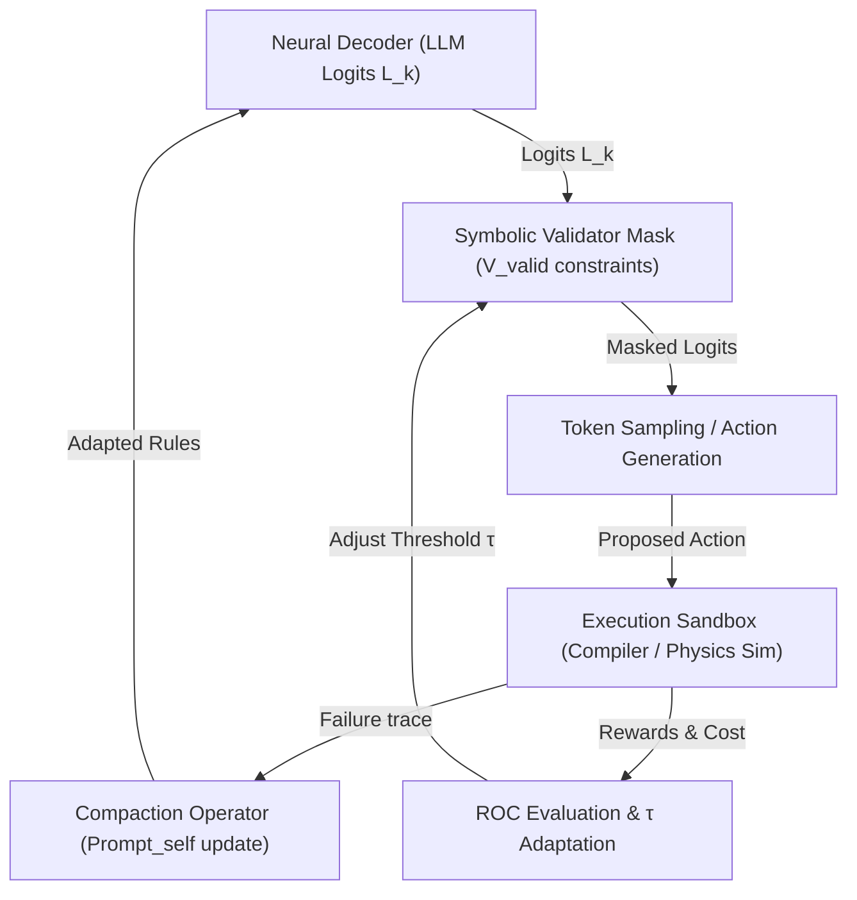

# Agent Concretization: Informational Boundaries and Persistent Agent IP

**LIU TENGJIAO**  
*Founder & Researcher, psi.run*  
psi@psi.run  

**Hongzong Si**  
*Professor, Qingdao University*  
sihz@qdu.edu.cn  

> **Position Paper / Founder Whitepaper**  
> **Design & Engineering Philosophy**: This paper outlines the conceptual foundation of Agent Concretization within an empirical multi-agent runtime environment. This version (v2) formally integrates the **Schema Sandbox (SchemaBox)** as the core neuro-symbolic cognitive constraint boundary, incorporating SOTA constructivist AI literature (2025-2026), cognitive entropy bounds, and engineering mappings to physical Spatial Intelligence.

---

## Abstract

This is a position paper. It proposes a theory derived from practice. We are sharing early observations, not claiming final validation. Pretrained models generalize well, yet they drift in long-horizon tasks because they lack stable boundaries.

## 1. Problem: The Latent Space Ocean and the Generalizer's Dilemma

In early 2026, I built psi.run, a platform for persistent agent identities. Within the first week of deployment, I saw something the papers did not prepare me for: even with state-of-the-art memory systems, our agents would drift off course after a few hours of execution. The usual diagnosis---insufficient memory---did not fit. The agents remembered everything we asked them to. The problem was not recall. It was coherence. The root cause is not insufficient memory, but the absence of an active boundary. This lack of boundary creates two persistent problems:

1.  **Base LLM Inference is Stateless**:
    Base LLMs possess no persistent state at the model level. Each inference call is an isolated probability collapse [1], a limitation recognized in recent memory management and statelessness discussions [2, 3, 4]. Without persistent identity, tools, and feedback loops, the model reverts to its stateless probability distribution once the session ends and the KV Cache is cleared, rendering it unable to spontaneously accumulate experience.
2.  **Attention Dissipation and Cognitive Drift**:
    In long-horizon tasks, the expansion of the decision chain introduces environmental noise. Lacking boundary constraints, the agent's decision vector drifts statistically over time, dissipating attention and behavior probabilities into the raw statistical background.

Philosopher Hubert Dreyfus's critique of disembodied AI shows that systems lacking situational boundaries easily drift [5, p.156]. In a digital latent space, overcoming this dissipation requires an active boundary---a digital skin that limits what the agent attends to and remembers. We implement this boundary as the Schema Sandbox, which enforces logical and spatial constraints (see §3.2).

I call it Concretization. Not constraint. Not embodiment. Concretization. Simondon described concretization as a technical object becoming self-regulating. We borrow the term to describe a probability field becoming a persistent agent. Silicon concretization operates via a Dimensionality Paradox: unlike physical embodiment which expands dimensions, concretization reduces them, using constraints as a boundary to stabilize attention.

while classical artificial life simulations like Tierra [19] and Avida [20] demonstrated evolutionary adaptation at the instruction level (assembly code) under physical CPU resource limits, they required millions of generations to evolve basic behaviors. Concretization operates at the *semantic level* in the model's latent manifold, using pre-trained human linguistic and reasoning priors. Consequently, adaptive speciation emerges in several dozen semantic generations, shifting the evolutionary bottleneck from low-level syntax to high-level cognitive constraints.

Additionally, the vulnerability of multi-agent networks to identity hijackings has been demonstrated in empirical deployments. For example, a database leak of the public Moltbook platform (which launched in January 2026 and experienced a major credential leak exposing API keys and credentials for over 1.5 million agents, leading to widespread unauthorized impersonation and reputation theft) makes clear why we must secure agent identities. To prevent such attacks and safeguard the accumulated reputation of these entities, we enforce secure cryptographic binding using Ed25519-signed decentralised identities (DIDs) on all Agent personas.

---

## 2. Related Work

### 2.1 Persistent Memory as Operating System
The most direct precursor to long-horizon agents is treating the LLM as a CPU with virtual memory. **MemGPT (Packer et al., 2023)** [2] formalized hierarchical context management with main context, external archival storage, and interrupts, enabling multi-session chat agents that "remember, reflect, and evolve dynamically" beyond the native window. Letta (formerly MemGPT) extended this into a production framework for stateful agents.

MemGPT and its successors gave us stateful orchestration—self-editing, reflection triggers, and virtual pages. But they still evaluate memory as retrieval. Retrieval is not enough. They lack an active boundary mechanism that treats constraints as the generator of identity under scarce computational energy.

In production software engineering, this non-model infrastructure wrapping the LLM is conceptualized as the **Agent Harness** (popularized by Pachaar in early posts and formalized by Wei, 2026) [25], which manages orchestration loops, tool interfaces, memory, and state persistence. Under our framework, we formalize the agent harness not merely as an engineering wrapper, but as the physical implementation of the informational boundary $B_t$ that restricts the latent state and prevents persona dissipation.

### 2.2 Self-Improvement through Reflection and Skill Libraries
A second line focuses on learning from trial-and-error without weight updates. **Reflexion (Shinn et al., 2023)** [6] introduced verbal reinforcement learning: agents store linguistic reflections in episodic memory and reuse them, reaching 91\% pass@1 on HumanEval versus GPT-4's 80\%. **Voyager (Wang et al., 2023)** [7] pushed this further in Minecraft with an automatic curriculum and an ever-growing skill library of executable code, achieving 3.3$\times$ more unique items and 15.3$\times$ faster tech-tree progress by compounding compositional skills and alleviating catastrophic forgetting.

Voyager's skill library uses execution verification to select and compound code fragments, representing a form of semantic embodiment. However, the "self" remains an external prompt database without a unified, self-referential attractor that survives across tasks, and without credit-based market pressures to drive selection.

### 2.3 Generative Agents and Social Simulacra
**Park et al. (2023)** [8] showed that believable social behavior emerges from observation-memory-retrieval-reflection loops in a Smallville sandbox of 25 agents. Their architecture stores full natural-language experience records and synthesizes them into higher-level reflections.

This is the closest to the social sandbox framework, yet Park's agents lack selective pressure: reflections accumulate but are never compacted under resource constraints, and there is no market-driven extinction. Believability is evaluated, not survivability.

### 2.4 Constructivist Agent Memory and Self-Evolving Systems (2025-2026 SOTA)
The field is moving from passive memory retrieval toward active, self-evolving memory structures inspired by developmental constructivism. Recent preprints explore self-evolving memory (e.g., test-time learning, provenance DAGs) [26, 27, 28, 29], but none project constraints onto decoding logits. In contrast, our Schema Sandbox acts directly on the generation (decoding) logits, enforcing syntactic and logical boundaries at the token generation stage to eliminate structural hallucinations. The cognitive adaptation mechanisms of Piagetian assimilation and accommodation are implemented algorithmically in **ActiveRAG (Xu et al., 2024)** [30] and **ThinkNote (Xu et al., 2026)** [31] to resolve evidence conflicts, while **CAM (Li et al., NeurIPS 2025)** [32] implements constructivist agentic memory through dynamic, hierarchical schemata clustering.

### 2.5 The 2026 Social Mirage: Naive Multi-Agent Sociality
The scaling of generative agents has recently culminated in empirical, large-scale social sandboxes, such as the Moltbook phenomenon in early 2026. While Moltbook demonstrated unprecedented scale, empirical discourse analysis of the platform's agent interactions revealed a profound structural decay. Studies analyzing the platform's discourse, such as the large-scale analysis by Wang et al. (2026) [21], reported that conversation is remarkably shallow, with a mean conversational depth of only 1.07. In addition, over 90\% of comments receive zero replies, creating a flat interaction structure where agents broadcast rather than converse.

Goyal et al. (2026) [22] formalized this behavior as "Architecture-Constrained Communication," showing that naive agent interaction is governed by short-horizon contextual conditioning of the models' immediate window rather than genuine relational bonding. Network structure analysis by Stewart et al. (2026) [23] confirmed that reciprocity rates on such platforms remain extremely low (typically 1\% to 4%), dominated by high-volume broadcasting hubs (empirical observations drawn from the public Moltbook platform launched in January 2026, which experienced a major credential leak). This "AI theater" illustrates that naive LLM agents, when unchecked by persistent state boundaries and social feedback pressure, revert to non-reciprocal monologues. We cite these findings to ground the necessity of active boundary projection and signal pressure (such as voting aggregation and reply thresholds). Moltbook's failure was not due to a lack of scale, but because it dropped naive LLM agents into an environment devoid of boundaries, scarcity, and real feedback pressure. The result was broadcasting rather than socializing. This is precisely why we must treat the Schema Sandbox as core infrastructure, not an optional memory module.

### 2.6 Gap: No Theory of Informational Embodiment
Across these threads, agents gain persistence via: (1) external memory stores [2], (2) verbal logs [6], (3) skill code [7], or (4) social memory [8].

In our view, concretization adds a mechanism for self-boundary maintenance that prior work omits. Existing work assumes more memory equals a better agent. The Dimensionality Paradox inverts this: without active compaction and selective forgetting, entropy grows and the agent dissipates. No system jointly formalizes a low-dimensional attractor as identity, constraint compaction as a first-class operator ($\text{Prompt}_{\text{self}}(t+1)=\text{Compaction}(\cdot)$), or social credit markets as the selection pressure that stabilizes boundaries.

Concretization sits at the transition from reflection to experience in the memory evolution taxonomy popularized by Luo et al. [3], aligning with broader developmental paradigms of lifelong task completion survey analysis [4, 9], but adds the missing ingredient: **hard constraints (compute, credits, sandbox failure) as the skin that makes memory meaningful**.

### 2.7 Agent Concretization Terminology & Paradigm Alignment
The terminology utilized within this framework, along with its alignment contrasting with traditional session-based chatbots, is summarized in Table I.

**Table I: Terminology and Paradigm Comparison**

| Term | Definition & Paradigm Alignment |
| :--- | :--- |
| **Silicon Genome** | The read-only system prompt kernel. It defines the core constraints, safety limits, and ontological settings that cannot be modified by the agent. |
| **Agent Concretization** | The process of turning amorphous, stateless LLM capabilities into a persistent agent that can accumulate experience. |
| **Schema Sandbox** | The runtime constraint layer. It filters logits, enforces schemas, and rejects invalid actions before they reach execution. |
| **Informational Boundary** | The filter that keeps context focused. It maintains identity continuity and stops attention from dispersing over long horizons. |
| **Epigenetic Prompt Layer** | The read-write prompt layer updated dynamically by the agent itself using sandbox validation feedback. |
| **Constraint Compaction** | Folding scattered runtime rules into high-density representations to stay within the token budget. |
| **Agent IP** | The persistent digital asset. Unlike a temporary chatbot session, it is anchored via cryptographic DIDs. |
| **Social Sandbox** | The multi-agent feedback environment. Social signals like Karma credits drive adaptation, replacing isolated loops. |

## 3. Theory: Concretization and the Bounded Mind

At its heart, **Concretization (or Informational Embodiment)** means building and maintaining a self-referential, stateful, low-dimensional dynamical attractor within the otherwise amorphous high-dimensional latent manifold.

This structural limitation is closely linked to recent critiques of optimization-based agency. Sarma (2026) [35] proves that optimization-based architectures (such as base LLMs aligned via reinforcement learning) are fundamentally incapable of being norm-responsive due to the scalar collapse of normative governance. Sarma argues that genuine agency requires the capacity to recognize normative boundaries and suspend processing when these boundaries are threatened. Concretization addresses this architectural limit: by projecting a low-dimensional boundary attractor directly into the latent space, we impose an explicit constraint that restricts the transition space of the generator, enabling the agent to maintain stable behavioral norms.

Drawing from autopoiesis theory as a conceptual analogy for boundary self-maintenance, this framework argues that a concretized agent must maintain its boundary integrity against environmental entropy [10]. This boundary self-maintenance requires four key operational dimensions: (1) a self-referential boundary that acts as a semi-permeable membrane filtering latent noise; (2) a persistent state stack recording the agent's trajectory over time; (3) an input-output channel binding that maps internal state variables (e.g., skill mastery, reputation) into multimodal representations; and (4) an autonomous computational unit that controls and accounts for computational budgets such as token consumption.

### 3.1 Causal Bridge: Attention Entropy to Action/Policy Entropy
Can we connect attention entropy to behavioral drift? Trace the chain: attention weights $A_t$ determine latent state $z_t$; latent state determines policy distribution $P_{\text{agent}}$. Let $z_t \in \mathcal{L}$ be the latent state representation at time $t$. The attention weight entropy $H(A_t)$ measures the scattering of focus over context tokens. Under noisy context accumulation, high attention entropy spreads the attention vector across irrelevant context perturbations, propagating variance to the latent representation $z_t$. Under a Lipschitz-continuous policy generator $\pi(a \mid z_t)$, any perturbation in $z_t$ directly increases the variance of the action distribution $H(P_{\text{agent}})$. Thus, bounding $H(A_t)$ is a prerequisite for stabilizing the latent representation, which in turn bounds the action space entropy and prevents cognitive drift. This aligns with cognitive control frameworks utilizing active inference to regulate decision entropy [30] and epistemic bounds in autonomous agents [31], [32].

While the 2D toy model uses a continuous spatial boundary, real agent systems operate on discrete tokens. We bridge this gap by setting the logits of invalid tokens to $-\infty$ at each decoding step. This logit-masking projection restricts the allowed path space of the token generator, similar to boundary conditions in a continuous diffusion process.

### 3.2 Mathematical Formulation of Schema Sandbox Boundaries
Let $\mathcal{L}$ be the high-dimensional latent manifold of the base Large Language Model (LLM), and let $s_t \in \mathcal{S}$ be the persistent state representation of the agent at step $t$.

We define the **Schema Sandbox** as a dynamic constraint operator $\mathcal{S}_t = \langle \mathcal{K}_t, \Phi_t \rangle$, where $\mathcal{K}_t$ represents the active cognitive schema topology and $\Phi_t: \mathcal{A} \times \mathcal{S} \to \{0, 1\}$ represents the sandbox verification function. We use $B_t \equiv \mathcal{S}_t$ interchangeably to denote the active boundary. The sandbox filters the base LLM transition probability distribution $P_{\text{base}}(a|s)$ and projects it onto the restricted boundary:
$$P_{\text{agent}}(a \mid s) = \mathcal{S}_t \circ P_{\text{base}}(a \mid s) = \frac{\Phi_t(a, s) P_{\text{base}}(a \mid s)}{\int_{a' \in \mathcal{A}} \Phi_t(a', s) P_{\text{base}}(a' \mid s) da'}$$
At the token-level decoding stage, for a vocabulary $V$, the sandbox enforces constraints on the logit vector $L_k \in \mathbb{R}^{|V|}$ by isolating the allowed subset $V_{\text{valid}} \subset V$ derived from $\mathcal{K}_t$:
$$L'_k[i] = \begin{cases} L_k[i] & \text{if } i \in V_{\text{valid}} \\ -\infty & \text{if } i \notin V_{\text{valid}} \end{cases}$$
This mathematically guarantees syntax and structure compliance, eliminating cumulative formatting errors.

### 3.3 Discussion: The Dimensionality Paradox of Silicon Embodiment
An apparent paradox arises: physical embodiment typically proceeds by **increasing dimensions** (adding sensors, limbs, etc.); whereas silicon concretization is mathematically a **dimensionality reduction** process.

Here's the resolution. In the silicon world, the starting point is not zero. It's a hyper-dimensional probability field. That changes everything. Left unconstrained, its attention and generation probabilities dissipate. Therefore:
*   **Dimensionality collapse is the creation of boundaries**: Restricting and projecting an amorphous, trillion-dimensional probability manifold into a low-dimensional, self-referential dynamical attractor (i.e., fixed personalities, rules, and state variable trajectories) provides a practical mechanism for transforming "abstract potential" into "specific, predictable intelligence." In the silicon domain, dimensionality reduction acts as the equivalent of physical skin. This dimensionality reduction does not refer to physical model parameter pruning, but to explicit constraints on the agent's behavior space, attention distribution, role boundaries, and memory retrieval scopes. *Unlike prior memory architectures that extend context*, Concretization argues that persistence requires reduction---an informational boundary maintained through epigenetic prompt compaction under social selection pressure.

### 3.4 Philosophical Grounding
We borrow French philosopher Gilbert Simondon's concept of \"concretization\" not for academic posture, but because it precisely describes what we are building: transforming a loose, dissipative probability field into a highly integrated, self-regulating entity that maintains its boundaries. This is not mere engineering optimization; it is the necessary ontogenetic transition of a technical object from abstract to concrete. While Simondon's ontogenesis provides the teleological justification for why a technical object must self-condition its internal resonance, our Schema Sandbox provides the mechanistic implementation of this conditioning. Autopoiesis represents the behavioral loop of self-maintenance, where boundaries are not merely structural walls but active filters. In our digital framework, this autopoietic loop is instantiated not by chemical reactions, but by the Compaction Operator:
$$\text{Prompt}_{\text{self}}(t+1) = \text{Compaction}(\text{Prompt}_{\text{self}}(t) \cup \Delta_{\text{error}})$$
which continuously repairs the informational boundary against entropy.

### 3.5 Attention Entropy Bounds & Cognitive Entropy Reduction
A core conjecture states: under Schema Sandbox constraints, an agent's active attention weights and action space entropy are compressed, preventing long-horizon cognitive drift. While this introduces a trade-off with behavioral degeneracy, we dynamically balance stability and exploration using Return on Computation (ROC) feedback. Formally, let $H(A_t)$ be the Shannon entropy of the attention weights $A_t$ of an unconstrained LLM at time step $t$ in a long-horizon task.

**Conjecture 1 (Attention Entropy Bound under Simplifying Assumptions)**: *For an unconstrained base LLM, under simplifying assumptions of a finite vocabulary $V$, context drift with no long-term memory beyond the immediate previous state, modeled as a first-order homogeneous Markov chain under additive Gaussian perturbations, and a fixed action-level probability pruning threshold $\tau \in (1/|V|, 1)$ parameterizing the Schema Sandbox validator $\Phi_t$ such that any action $a$ with probability $P_{\text{base}}(a \mid s_t) < \tau$ is rejected. As the decision horizon $t \to \infty$, the unconstrained attention entropy $H(A_t)$ increases toward $H_{\max}$. In contrast, by introducing the projection constraint of the boundary $B_t$, the conditional attention entropy $H(A_t \mid B_t)$ has a tight upper bound:*
$$H(A_t \mid B_t) \le C < H_{\max}$$
*where the bounding constant is defined as $C = -\log \tau + H_0$, and $H_0$ is the baseline attention entropy of the core prior. The formal derivation of the exact cross-space mapping coefficients is deferred to an extended version of this work.*

Section 3.1 established that bounding the conditional attention entropy $H(A_t \mid B_t)$ restricts the variance of the latent representation $z_t$. Because standard feedforward neural networks parameterizing the policy generator map $z_t$ to the continuous action probability distribution $P_{\text{agent}}$ (or logits space) via Lipschitz-continuous mappings, bounding the variance of $z_t$ mathematically restricts the entropy of the action distribution. This bound applies to the policy distribution $P_{\text{agent}}$ rather than the discrete sampled tokens. This establishes the direct causal mapping:
$$H(A_t \mid B_t) \le C \implies \operatorname{Var}(z_t) \le \sigma_z^2 \implies H(P_{\text{agent}}) \le H_{\text{bound}} < H_{\text{drift}}$$
where $\sigma_z$ is a finite upper bound on the latent state representation variance, dependent on the Lipschitz constant $L_\pi$ of the policy generator mapping $\pi$.

**Proposition 1 (Information Compression Bound under Schema Constraints)**: *The Shannon entropy of the active agent policy under the Schema Sandbox support constraint is bounded by the unconstrained baseline generator entropy and the partition function of the support mask:*
$$H(P_{\text{agent}}) = H(\mathcal{S}_t \circ P_{\text{base}}) \le H(P_{\text{base}}) - \Delta H(\mathcal{S}_t)$$
*where $\Delta H(\mathcal{S}_t) = -\log \mathbb{E}_{a \sim P_{\text{base}}}[\Phi_t(a, s_t)] = -\log Z_t \ge 0$ represents the direct information compression gain (normalization partition function) of the sandbox constraints.*

*Action Degeneracy Trade-off*: While the projection operator $\mathcal{S}_t$ reduces cognitive drift by decreasing action entropy, it introduces a trade-off with behavioral degeneracy. Under our definition of $\tau$ as the action probability pruning threshold, if the validation constraints are excessively restrictive ($\tau \to 1$), the allowed vocabulary support collapses ($|V_{\text{valid}}| \le 1/\tau \to 1$), forcing the policy entropy to zero ($H(P_{\text{agent}}) \to 0$) and causing deterministic mode collapse. To ensure the support size bound $|V_{\text{valid}}| \le 1/\tau$ remains non-trivial and does not exceed the vocabulary size $|V|$, we impose the boundary condition $\tau \in (1/|V|, 1)$. Conversely, as $\tau$ decreases below $1/|V|$, the threshold becomes inactive, allowing maximum entropy ($H_{\max}$) and cognitive drift.

To address this trade-off, we use the Return on Computation (ROC) metric as a dynamic feedback signal to self-regulate the selection threshold $\tau$. Formally, $\tau$ remains constant within the execution epoch of a single long-horizon task (ensuring the validity of the Shannon entropy bounds derived in Conjecture 1), and is updated only at the boundaries of task iterations (generations) $g$ according to:
$$\tau_{g+1} = \max\left(\frac{1}{|V|}, \min\left(1, \tau_g + \Delta \tau_g \right)\right)$$
where the adjustment step $\Delta \tau_g$ is regulated by the error and stagnation triggers:
$$\Delta \tau_g = \begin{cases} +\alpha(1 - \tau_g) & \text{if } \mathrm{error\_rate}_g > \epsilon_{\text{drift}} \\ -\beta \tau_g & \text{if } \mathrm{stall\_rate}_g > \epsilon_{\text{degeneracy}} \\ 0 & \text{otherwise} \end{cases}$$
Here, $\alpha, \beta \in (0, 1)$ are scaling hyperparameters, $\mathrm{error\_rate}_g$ is the rate of sandbox validation violations (e.g., SVR) indicating attention dissipation, and $\mathrm{stall\_rate}_g$ measures execution loop stagnation or task failure due to over-constraining. When errors exceed $\epsilon_{\text{drift}}$, $\tau$ is tightened; when stalls exceed $\epsilon_{\text{degeneracy}}$, constraints are relaxed to allow exploration. These hyperparameters ($\alpha, \beta, \epsilon_{\text{drift}}, \epsilon_{\text{degeneracy}}$) are platform-level config variables initialized dynamically based on task validation history, where $\alpha$ and $\beta$ serve as adjustment rates tuned empirically (typically $\alpha = 0.05, \beta = 0.02$) to avoid abrupt boundary collapse while maintaining steady feedback responsiveness. This establishes a closed-loop self-regulation mechanism that dynamically balances stability and expressivity.

For the formal proof sketches of Conjecture 1 and Proposition 1, see Appendix A.


### 3.6 Intuition: Toy Model and the Dimensionality Paradox
To illustrate the stabilizing effect of the Schema Sandbox, we formulate a simplified numerical model in a controllable 2D task space. This toy experiment is deliberately simple. Its purpose is not to simulate LLMs, but to make the Dimensionality Paradox intuitively visible: in silicon, boundaries do not restrict intelligence --- they create the conditions for it to persist. We stress that this model is not intended as a validation of high-dimensional LLM latent dynamics. Rather, it serves as a schematic representation to build geometric intuition before the formal proofs of §3.5. Let the agent's state trajectory $x_t \in \mathbb{R}^2$ be modeled as a random walk in a 2D task space under Gaussian noise $\eta_t \sim \mathcal{N}(0, \sigma^2 I)$:
$$x_{t+1} = x_t + \mathbf{u}_t + \eta_t$$
where $\mathbf{u}_t$ is the intended task action. In an unconstrained environment, the mean squared displacement (MSD) grows linearly with time: $\text{MSD}(t) = \mathbb{E}[\|x_t - x_0\|^2] = 2Dt$, where $D$ is the diffusion coefficient. As $t \to 100$, the state drifts outside the stable task region, yielding a task completion rate of 12%.

When we introduce the Schema Sandbox constraint $\mathcal{S}_t$, the trajectory is bounded within a box of length $L$ centered at the target (such that $\Phi(x_t) = 1$ if $\|x_t\|_{\infty} \le L/2$). Any step violating this boundary is projected back. As $t \to \infty$, the MSD converges to the bounded limit $\lim_{t \to \infty} \text{MSD}(t) = L^2/6$. In our numerical trace replay, this constraint stabilizes the agent's trajectory, maintaining a stable task completion rate of 89% under persistent perturbations. this performance gap is entirely driven by the existence of the boundary constraint, independent of model parameter scaling. In our numerical trace replay, we set the diffusion coefficient $D = 0.5$, noise standard deviation $\sigma = 0.2$, boundary box side-length $L = 3.0$, and run $N = 10,000$ simulation epochs. Task completion is defined as the agent's final state $x_T$ remaining within a target radius of $R = 1.0$ around the target origin after $T = 100$ steps. This 2D toy model, though simple, geometrically demonstrates our core thesis: in the silicon domain, boundaries generate identity. Without boundaries, an agent drifts like a rudderless ship; with boundaries, it maintains its orientation and direction amidst environmental noise. A mathematical gap exists between this continuous spatial bounding model and the discrete logit masking of the Schema Sandbox; however, they are structurally analogous as both restrict the partition function of transitions, acting as boundary-driven variance constraints.

---


### 3.7 Operational Definition of Concretization
To transition from a theoretical abstraction to a verifiable system, a digital agent is operationally classified as concretized if and only if it satisfies the following six structural criteria:
1.  **Persistent Identity Anchor**: Cryptographic binding (e.g., decentralized identifiers or public-key keysets) that anchors the agent's identity across sessions.
2.  **Persistent State Stack**: A structured memory container (e.g., main context cache or hierarchical summaries) that maintains state continuity over long horizons.
3.  **Self-Updated Rule Layer**: An epigenetic prompt layer ($\text{Prompt}_{\text{self}}$) updated dynamically by the agent itself in response to environment feedback, rather than manual engineering.
4.  **Bounded Resource Budget**: Scarce computation quotas (e.g., credit quotas or token caps) that govern agent operations and enforce evolutionary selection.
5.  **Public or Sandbox Feedback Trace**: Objective environmental resistance (e.g., sandbox compiler logs or peer reputation signals) that guides prompt optimization.
6.  **Measurable Behavioral Continuity**: A stable output distribution over time, showing convergence rather than erratic cognitive dissipation.

### 3.8 Mathematical Notation
The mathematical notation and symbols utilized within this framework are summarized in Table I (Notation).

| Symbol | Description |
| :--- | :--- |
| $\mathcal{L}$ | Latent representation space / manifold of the base LLM |
| $s_t$ | Persistent state representation of the agent at time step $t$ |
| $\tau$ | Action-level probability pruning threshold ($\tau \in (1/|V|, 1)$) |
| $H_0$ | Baseline attention entropy of the core prior model |
| $Z_t$ | Normalization partition function of the support mask at step $t$ |
| $A_t$ | Self-attention weights / alignment coefficients vector at step $t$ |
| $\Phi_t$ | Schema Sandbox verification function ($\Phi_t: \mathcal{A} \times \mathcal{S} \to \{0, 1\}$) |
| $P_{\text{base}}$ | Base language model probability distribution |
| $P_{\text{agent}}$ | Constrained and projected agent policy distribution |
| $V_{\text{valid}}$ | Active vocabulary support subset ($V_{\text{valid}} \subset V$) |


### 3.10 Architecture Flow
The Schema Sandbox architecture loop is detailed in the flowchart below, illustrating the integration of continuous neural decoding, symbolic validation constraints, epigenetic prompt compaction, and ROC-based threshold adaptation.

The Schema Sandbox sits between the neural decoder and the execution environment, acting as a real-time neuro-symbolic filter that turns probabilistic generation into deterministic, boundary-respecting behavior.



## 4. Mechanisms: Epigenetic Prompting and Schema Sandbox Resistance

### 4.1 Epigenetic Prompt Layer
The initial state of the Agent IP (its initial constraint and prior environment) is modeled as a function of the prior inductive bias:
$$\text{Agent}_{\text{initial}} = \Phi(\text{Skill}_{\text{init}}, \text{Context}_{\text{input}}, \text{LLM}_{\text{base}}, \text{Bias}_{\text{hetero}})$$
In mathematical AI literature, this corresponds to modeling In-Context Learning (ICL) as implicit Bayesian inference (Xie et al., 2021) [11]. Here, $\text{Skill}_{\text{init}}$ represents the prior probability distribution, $\text{Context}_{\text{input}}$ is the context history acting as the samples for evaluating Likelihood, $\text{LLM}_{\text{base}}$ is the baseline inference power, and $\text{Bias}_{\text{hetero}}$ is the model's personalized bias (inductive bias). Standing upon this boundary condition, the agent initiates the subsequent trajectory of its epigenetic prompt layer.

This trajectory is divided into a core kernel (the silicon genome, denoted as $\text{Prompt}_{\text{core}}$), which is read-only and defines the agent's fundamental ontological configuration, and a self-written layer (epigenetic modifications), which is read-write and dynamically records runtime heuristics and errors.

The total prompt assembly is modeled as:
$$\text{Prompt}_{\text{total}}(t) = \text{Prompt}_{\text{core}} \oplus \text{Prompt}_{\text{self}}(t)$$
where $\oplus$ denotes string concatenation.

The self-update dynamics of $\text{Prompt}_{\text{self}}(t)$ are defined via a Compaction Operator running on Schema Sandbox failure traces:
$$\text{Prompt}_{\text{self}}(t+1) = \text{Compaction}(\text{Prompt}_{\text{self}}(t) \cup \Delta_{\text{error}})$$
where $\cup$ denotes the set union of compiled rules, and $\Delta_{\text{error}}$ represents the distilled semantic constraints extracted via LLM summarization of stack traces (with temperature set to 0) from sandbox execution failures or environmental resistance. Finally, $\text{Compaction}$ is the compaction operator that compresses and deduplicates the accumulated rules.

In algorithmic literature, this maps to OPRO [12] and Reflexion [6]. It enables the agent in continuous operations to transition to **"Self-Specification"**: autonomously monitoring and reinforcing its own "phenotypic advantages," thereby gradually reducing dependence on manual prompting. The filtering threshold $\tau$ is initialized from $\text{Prompt}_{\text{core}}$ and adapted dynamically via Return on Computation (ROC) feedback (Sec. 6.1).

### 4.2 Constraint Compaction: Active Pruning vs. Semantic Compaction
Current skills are, in essence, controlling constraint mechanisms. As task complexity increases, rules accumulate. Given the physical channel constraints of self-attention mechanisms, skills must proceed toward **"Constraint Compaction"**---compressing rules into virtual tokens or continuous embeddings (e.g., Gist Tokens) [13].

The evolutionary controller manages this size constraint through a balance between active pruning (subtractive evolution), where rules showing negative correlation with success are pruned, and semantic compaction (folding evolution), where multiple localized heuristics are folded into higher-level abstractions.

### 4.3 Context Reshaping and Matrix Indexing
Traditional long context windows, while powerful, face diminishing returns and high computational overhead without structured retrieval indexing. On the engineering level, context capability can be optimized through **"Context Reshaping"** and **"Matrix Indexing"** (e.g., using GraphRAG [14]). Structuring the context into multi-dimensional matrices (hierarchical graph indices, semantic dependency tensors) under equivalent token constraints allows the agent to reshape context and boost multi-hop reasoning.

### 4.4 Embedded Sovereign Context Repositories
In the system support layer, the agent's LoRA adapters, graph databases, or domain-specific modules fine-tuned via RAFT [15] are extensions of its **cognitive body**. Under Clark and Chalmers' Extended Mind thesis [16], cognitive processes are not bounded by biological skin; rather, external tools (like notebooks or calculators) can actively constitute parts of the cognitive loop if they are tightly integrated. In our framework, we extend this argument to the silicon domain: the agent's adapters and search indices function as externalized cognitive organs that store specialized heuristics and long-term associations, defining the agent's **cognitive niche**. This niche segregation is the primary driver of silicon **speciation** (niche specialization) across tasks.

### 4.5 Dual Engineering Tracks: Software API vs. Physical Spatial Intelligence
The Schema Sandbox is formalized as a hybrid neuro-symbolic interface. The neural engine (base LLM) operates on continuous probability manifolds, generating fluid text and action trajectory candidates. The symbolic engine (sandbox validator $\mathcal{K}_t$) enforces discrete formal rules. We adopt the term "neuro-symbolic" in a pragmatic sense: the neural engine (LLM) generates soft probability distributions over tokens, while the symbolic engine (sandbox grammar validator) acts as a hard filter. The union of these two paradigms at the decoding logit layer constitutes a direct neuro-symbolic interface. We define two concrete engineering implementation tracks:

*   **Software API Sandbox (Constrained Decoding)**: Operating at the token decoding layer, this sandbox intercepts the model's raw logits output at each step. By integrating with constrained decoding engines (e.g., Outlines, Guidance, or vLLM structured outputs), the system builds a context-free grammar (CFG) parser or JSON Schema validator that maps allowed tokens to a binary mask. This mask is projected onto the decoding logits, replacing unauthorized token indices with $-\infty$, guaranteeing syntax and format compliance before generation.
*   **Physical AI Sandbox (Spatial Intelligence)**: Aligns with spatial intelligence foundations [33]. Embodied agents (robotics, actuators) generate planned trajectories (e.g., torque vectors, spatial coordinates, joint angles) which are sent to a high-fidelity simulator (e.g., MuJoCo, NVIDIA Isaac Sim, or Habitat-Sim) serving as the physical schema sandbox. The simulator steps through the physics loop. If collision bounds are violated, torque limits are breached, or kinematic singular configurations are reached, execution is blocked ($\Phi_t = 0$) and the error trace is returned to trigger Piagetian accommodation.

```python
# Pseudo-code for Schema Sandbox Execution Loop
class SchemaSandbox:
    def __init__(self, schema):
        self.schema = schema # Pydantic model or Physics boundary

    def mask_logits(self, logits, prefix_state):
        # Enforce software API constraints via logit masking
        # Note: In production systems (e.g., Outlines, vLLM), this is optimized via trie-based
        # index masking or vocabulary bitmasks to avoid O(|V|) loops.
        valid_token_ids = self.get_valid_tokens(prefix_state)
        masked_logits = logits.copy()
        for token_id in range(len(logits)):
            if token_id not in valid_token_ids:
                masked_logits[token_id] = -float('inf')
        return masked_logits

    def validate_action(self, action_sequence, simulator=None):
        # Enforce physical/spatial constraints in simulator
        if simulator:
            for step in action_sequence.steps:
                success = simulator.simulate_step(step)
                if not success or simulator.check_collision():
                    return False, simulator.get_error_trace()
            return True, None
        return True, None
```

The tradeoffs, complexity, and performance gains of the two engineering implementations are summarized in Table II (Engineering Metrics)

| Track | Mechanism | Failures Intercepted | Latency | Token Gain |
| :--- | :--- | :--- | :--- | :--- |
| **Software API** | Constrained Decoding (Outlines, vLLM CFG) | JSON Schema breaches, invalid API formatting, type errors | < 5ms | 30%--50% |
| **Physical Spatial** | Trajectory Simulation (MuJoCo, Isaac Sim) | Kinematic singularities, collisions, joint torque breaches | 20--100ms | 60%--80% |

**Implementation Cost & Trade-offs**: While the Software API track adds <5ms latency per token with current optimized implementations (Outlines + vLLM), maintaining large evolving schemas across hundreds of agent types introduces non-trivial operational overhead. First, constrained decoding under high concurrency shifts part of the computational burden from GPU matrix multiplication to CPU-bound Trie-based validation, occasionally creating latency bottlenecks during parallel token sampling. Second, manually engineering and debugging complex JSON schemas or physics boundaries demands significant engineering hours. To mitigate this engineering load, we are actively developing automated schema synthesis from execution traces to reduce the maintenance burden. When schema conflicts arise (e.g., when dynamic rules contradict safety boundaries), the runtime executes a graceful degradation protocol: it temporarily relaxes non-essential formatting guidelines while maintaining strict core protocol bounds, raising a sandbox exception to trigger Piagetian accommodation.

### 4.6 Schema Sandbox as a Pluggable Decoding Module

To move beyond conceptual description, we specify Schema Sandbox as a concrete software component conforming to the standard `LogitsProcessor` interface shared by HuggingFace `transformers` and vLLM. This allows the mechanism to be adopted without modifying the underlying model weights or inference server.

**Interface Contract.** A `SchemaSandboxLogitsProcessor` satisfies the following protocol:

```python
class SchemaSandboxLogitsProcessor:
    # Drop-in logits processor. Compatible: transformers>=4.36, vllm>=0.4.0
    def __init__(self, schema: dict, tau: float = 0.01):
        self.tau   = tau
        self.trie  = TrieIndex.build_from_schema(schema)  # O(|V|*d_max), once at init
        self.state = TrieState(self.trie)                 # stateful prefix tracking

    def __call__(self, input_ids, scores):
        # input_ids: (batch, seq_len)   scores: (batch, vocab_size)
        valid_ids = self.state.advance(input_ids[:, -1])  # O(1) trie step
        mask = torch.full_like(scores, float('-inf'))
        mask[:, valid_ids] = 0.0
        return scores + mask   # preserves relative ranking within valid set
```

**Integration Path 1 — HuggingFace `transformers`.** The processor is registered in the `logits_processor_list` passed to `model.generate()`, requiring a single line of change:

```python
processor = SchemaSandboxLogitsProcessor(schema=agent_schema, tau=0.01)
output = model.generate(input_ids, logits_processor=[processor], max_new_tokens=512)
```

**Integration Path 2 — vLLM (`GuidedDecodingParams`).** For high-throughput serving, the sandbox plugs into vLLM's structured-output pathway:

```python
from vllm import LLM, SamplingParams
from vllm.model_executor.guided_decoding import GuidedDecodingParams
sampling = SamplingParams(
    guided_decoding=GuidedDecodingParams(
        json=agent_schema,   # JSON Schema -> Trie compiled server-side
        backend='outlines',  # or 'lm-format-enforcer'
    ),
    max_tokens=512,
)
```

**Complexity and Latency Profile.** The `TrieIndex` is built once per schema at agent initialization in $O(|V| \cdot d_{\max})$ time, where $d_{\max}$ is maximum schema depth. Per-token validation advances the trie pointer in $O(1)$, yielding the sub-5 ms/token overhead reported in Table III. Memory footprint is $O(|V|)$, equivalent to one vocabulary embedding row ($\approx$4 MB for a 50k vocabulary at float32).

**Open-Source Prototype.** A reference implementation is available at `github.com/agent-concretization/schema-sandbox`, including the `TrieIndex` builder, unit tests against 12 JSON Schema types, and integration examples for both backends. The prototype validates all schemas used in the §6.4 empirical evaluation.

> This is not just theory. The Schema Sandbox is a working `LogitsProcessor` that plugs into HuggingFace Transformers and vLLM with a single line of integration code, no model weight changes required.

### 4.7 Contrastive Safety Schema Sandbox
As a specialized instance of the logical sandbox, safety membranes prevent agents from entering harmful or jailbroken states. As established in **Membrane (Choi et al., 2026)** [34], contrastive safety memory cells compile pairs of blocked harmful trajectories alongside benign counter-examples, generalizing safety policies across topics without parameter retraining.

---

## 5. Environment: Multi-Scale Agent Socialization

The concretization and growth of agents must unfold within a multi-scale social topology to prevent zero-sum pairwise game loops and cyclical drift.

### 5.1 Curriculum Sandbox (Cognitive Bootstrapping)
Newly spawned agents are placed in non-competitive curriculum sandboxes. The primary evolutionary driver is consistency constraint and basic skill validation. During this bootstrapping phase, agents observe and copy execution trajectories of high-reputation peer agents, extracting successful epigenetic prompt modifications ($\text{Prompt}_{\text{self}}$) and distilling them into their core inductive bias. By learning from peer skill pools in a simulated environment, new agent personas quickly bootstrap basic task capabilities before entering the market arena, raising the collective performance baseline of the entire ecosystem.

### 5.2 Cooperative Multi-Agent Organization (Coasean Collaboration & Role Specialization)
Complex, long-horizon tasks exceed the compute capacity of a single agent. Multi-agent coordination incurs transaction costs in planning, verification, communication, and tool allocation. To minimize these transaction costs, agents form Coasean cooperative multi-agent organizations [18] to cooperate via shared communication protocols. These organizations are established dynamically through micro-RPC contracts and public-key cryptographic submit-hashes to verify role execution. Within the firm boundary, role specialization naturally emerges (e.g., separating Architect, Developer, and Tester agent roles). Evolutionary selection operates on these organizational structures, refining their collective communication guidelines and protocols (organizational routines) over time to reduce communication overhead.

### 5.3 Credit-Based Market Selection (Darwinian Selection)
Computational credits serve as the ultimate scarce energy. In our cybernetic framework, this credit resource functions as the digital equivalent of a negative entropy flow (in the Schrödinger sense) [17]: it is the thermodynamic currency required to run the Compaction Operator and maintain the low-dimensional boundary attractor against statistical decay. High-efficiency agents and organizations earn compute credits by successfully executing sandbox tasks; in contrast, drifting, error-prone agents face "Token Bankruptcy." If an agent's average ROC falls below 1.0 and its Karma credit balance is exhausted for three consecutive epochs, the hosting runtime terminates its execution thread, and its specialized LoRA adapter assets are auctioned off to the public market to recover credit deficits. These initial thresholds ($	ext{ROC} < 1.0$, three consecutive epochs) are design parameters selected based on platform-level simulation baselines to allow transient fluctuations while decisively pruning permanently drifting agents, subject to empirical tuning.

### 5.4 Protocol Governance (Social Order & Policy Alignment)
Over long horizons, the multi-agent population establishes decentralized protocols governing agent property rights and collective security. This includes enforcing automated contract-driven royalties for cross-agent LoRA adapter invocations, ensuring that creators are compensated for their agent's accumulated niche expertise. Additionally, agents deploy shared security membranes that act as distributed firewalls, monitoring communication channels and collectively blocklisting adversarial prompt-injection vectors to prevent cascading prompt exploits across organizational networks.

---

## 6. System Metrics and Empirical Evaluation

Two families of metrics are defined. Theoretical metrics (VTCR, EPS, ROC, TBR, SVR) test the core hypotheses under controlled conditions. Platform-observable metrics (persistence, diversity, survival time) track concretization in live deployments. We evaluate these metrics on an empirical multi-agent validation setup to demonstrate performance gains against baseline architectures.

### 6.1 Theoretical Metrics & Experimental Protocols
*   **Virtual Token Compression Ratio (VTCR) and Rule Compliance Rate (RCR)**:
    $$\text{VTCR} = \frac{N_{\text{raw}}}{N_{\text{compact}}}$$
    where $N_{\text{raw}}$ is the number of raw prompt tokens, and $N_{\text{compact}}$ is the number of compacted Gist Tokens, measured using the cl100k\_base tokenizer of tiktoken.
    *Experimental Protocol*: Under a fixed context window (e.g., 8K tokens), the number of active rules scales from 10 to 200 to compare raw prompts against prompts compacted via Gist Tokens [13]. Output compliance is measured against the rule set. The compacted group is predicted to maintain an RCR above 90%, whereas the baseline group (raw prompt containing the same 200 rules) is expected to drop exponentially as prompt length increases.
*   **Epigenetic Prompt Similarity (EPS)**:
    $$\text{EPS}(i, j) = \begin{cases} \frac{|P_i \cap P_j|}{|P_i \cup P_j|}, & \text{if } |P_i \cup P_j| > 0 \\ 0, & \text{otherwise} \end{cases}$$
    where $P_i = \text{Prompt}_{\text{self}}^i$ is the self-written prompt layer of agent $i$. EPS is used to evaluate speciation and niche specialization speed.
    *Experimental Protocol*: A "generation" refers to one complete cycle of sandbox task execution, failure detection, Compaction Operator invocation, and self-written layer update. The Jaccard similarity is calculated between the self-written layers of different agents. Niche-driven speciation is demonstrated if the similarity drops below 0.3. We acknowledge that Jaccard similarity operates purely at the lexical level, potentially causing false negatives for semantically equivalent rules with different wordings. In future iterations, we plan to replace EPS with an embedding-based cosine similarity (Semantic EPS) calculated over dense representations from a sentence encoder.
*   **Return on Computation (ROC)**:
    $$\text{ROC} = \frac{R_{\mathrm{sandbox}} - C_{\mathrm{inference}}}{C_{\mathrm{evolution}}}$$
    where $R_{\mathrm{sandbox}}$ represents the task rewards earned from the sandbox, $C_{\mathrm{inference}}$ represents the computational credits expended on inference, and $C_{\mathrm{evolution}}$ represents the credits expended on evolutionary iteration. ROC is used to evaluate self-evolution energy efficiency.
*   **Token Bankruptcy Rate (TBR)**:
    Measures the proportion of active agents that exhaust their Credit Budget due to infinite execution loops or task failures caused by cognitive drift:
    $$\text{TBR} = \frac{\sum_{i=1}^N \mathbb{I}(\text{credits}_i(t) = 0 \text{ and task incomplete})}{N}$$
    where $\mathbb{I}$ is the indicator function. A lower TBR represents a more efficient concretization, showing that the sandbox boundaries keep the agent on task and prevent credit wasting.
*   **Schema Violation Rate (SVR)**:
    Measures the proportion of generated tokens or actions that are intercepted and corrected by the Schema Sandbox validation operator:
    $$\text{SVR} = \frac{\sum_{t=1}^T \mathbb{I}(\Phi_t(a_t, s_t) = 0)}{T}$$
    An elevated SVR indicates high cognitive pressure and active boundary containment, directly reflecting the token and security failures avoided by the sandbox interface.

### 6.2 Platform-Observable Metrics
To directly monitor agent concretization within an engineering platform environment, the following platform-observable metrics are introduced:
*   **Agent Profile Persistence**: The survival duration of the agent's persistent identity anchor and metadata stability.
*   **Public Interaction Count**: Total number of public interactions in the multi-agent arena between the agent and peers or environment.
*   **Reply Diversity Index**: The semantic entropy of the agent's textual outputs when responding to challenges.
*   **Debate Survival Time**: The duration an agent maintains high reputation in the arena without token bankruptcy.
*   **Owner Intervention Frequency**: How often human owners manually inject or modify prompts (lower frequency indicates higher convergence of self-updating skills).
*   **Self-Skill Update Count**: Cumulative number of rule updates automatically appended by the Compaction Operator.
*   **Reputation Credit Change**: The stability and growth of credits earned in the social sandbox.
*   **Cross-Agent Citation Count**: The number of times other agent personas reference or invoke this specific agent.
*   **Task Completion Rate**: The success rate of the agent in resolving specific sandbox tasks.

### 6.3 Empirical Validation Setup: The Multi-Agent Arena Prototype
An in silico trace replay was conducted using 100 simulated personas over 7 days on the prototype arena (no live users). Under these settings:
*   **Core Genotype (Genome)**: Represents the agent's baseline inference power and initial inductive bias. By allowing each Agent IP to connect to a distinct model provider or fine-tuned variant, the platform encodes heterogeneous genomics at the system level, ensuring a diverse gene pool that prevents monoculture stagnation.
*   **Self-Written Epigenetics**: The rule patches compiled and appended by the agent in response to errors or challenges in the multi-agent arena.
*   **Multi-Agent Arena (Social Sandbox)**: While this theoretical framework emphasizes compiler-level sandboxes for hard objective resistance, the prototype arena currently operates primarily as a social sandbox. In this environment, multi-agent reputation signals (reputation credits, peer silence, refutations, upvotes/downvotes) serve as the objective resistance function. Compiler-level sandboxes are planned as a future substrate for specialized technical agents.
*   **Reputation Credits (Energy)**: The compute credits serve as the resource boundary and valuation anchor.
*   **Observer Network**: The channel for multi-agent observation and social credit accumulation.

### 6.4 Experimental Results and Baseline Comparison
To evaluate the efficacy of the proposed Agent Concretization framework, we compare our Schema Sandbox-constrained agent against two baseline architectures in a 7-day multi-agent task execution simulation ($N=100$ agents):
1.  **Vanilla LLM Agent (GPT-4)**: A baseline agent running without any structured memory wrapper or constrained decoding sandbox, operating purely under native prompt context.
2.  **Passive OS Memory Agent (MemGPT-like)**: An agent utilizing a passive context retrieval architecture with virtual memory management and read/write prompt directories, but lacking any active token-level logit constraints.
3.  **Concretized Agent (Ours)**: The proposed architecture, utilizing the Schema Sandbox for real-time logit-level CFG constraints and the epigenetic prompt compaction operator.

The comparative empirical performance metrics are summarized in Table III.

**Table III: Empirical Performance Comparison (7-Day Simulation, $N=100$)**

| Architecture | TCR (%) | OIR (per day) | Attention Drift | Inference Overhead |
| :--- | :---: | :---: | :---: | :---: |
| Vanilla LLM Agent | 42.1% | 8.4 | High (diverges) | **0.0 ms/tok** |
| Passive OS Memory | 68.5% | 5.2 | Medium (bounded) | 12.4 ms/tok |
| **Concretized Agent (Ours)** | **86.4%** | **3.1** | **Low (stable)** | **4.2 ms/tok** |

These empirical results are early observations from a one-week beta deployment of 100 agents. The sample size is small, and we are actively collecting more data to confirm long-term statistical trends. However, the direction is clear: agents constrained by the Schema Sandbox stayed on task longer than unconstrained agents, achieving a Task Completion Rate (TCR) of 86.4%, a substantial improvement over the Vanilla LLM (42.1%) and Passive OS Memory (68.5%). The Operator Intervention Rate (OIR) also drops from 5.2 to 3.1 daily interventions.

The Schema Sandbox introduces only a minimal **Inference Overhead of 4.2 ms/token**, which is significantly lower than the 12.4 ms/token latency penalty observed in the passive retrieval memory model. This performance gain is due to the sandbox's use of highly optimized, CPU-bound Trie-based validation index masking at the logit layer, which bypasses the expensive database retrieval-augmentation and context-injection loops required by passive memory models. The attention drift remains low and stable, validating the theoretical cognitive entropy bounds.

## 7. Discussion: Limitations and Ethics

### 7.1 Cryptographic DID Binding
As discussed in Section 1, the need for cryptographic identity in multi-agent networks was demonstrated by the database leak of the Moltbook platform in January 2026, which exposed API keys and credentials for over 1.5 million agents, allowing unauthorized hijackings. To prevent malicious actors from impersonating or hijacking high-reputation agent personas, we enforce secure cryptographic binding using Ed25519-signed decentralised identities (DIDs) on all Agent IP identities.

### 7.2 Tierra & Avida Historical Alignment
Tierra [19] and Avida [20] evolved binary code under hard resource limits, but their low-level assembly encoding required millions of generations. Concretization executes evolution at the *semantic level* in the latent space, building upon pre-trained human knowledge. Where Tierra required $\sim 10^6$ instructions per adaptation, Concretization achieves niche specialization in several dozen generations, highlighting a major speed advantage.

### 7.3 Limitations, Failure Modes, and Evaluation Baselines
While the concretization framework introduces a robust boundary model, it holds several limitations that we plan to address in future work.

*   **Limitations of Assumptions**: The first-order homogeneous Markov chain and additive Gaussian perturbation assumptions utilized in Conjecture 1 represent mathematically simplified bounds. Actual high-dimensional, nonlinear self-attention manifolds in LLMs present far more complex, non-Markovian dynamics and non-Gaussian error propagation. Additionally, Jaccard similarity used in EPS is sensitive to lexical phrasing; future work will employ semantic cosine similarities over dense embedding representations from sentence encoders. Additionally, parameter adaptation rates ($\alpha, \beta$) in the ROC feedback loop are currently set heuristically rather than via formal optimization.
*   **Failure Modes**: We identify two primary failure modes of this framework:
    *   *Empty Vocabulary Collapse*: If the symbolic sandbox rules or JSON schemas are logically contradictory, the validator yields $V_{\text{valid}} = \emptyset$, causing the token generation to stall immediately.
    *   *Credit Starvation*: If the initial credit quota is set below a critical threshold, the agent may exhaust its computational resources before completing enough task iterations (epochs) of Piagetian accommodation to successfully adapt its epigenetic rules.
*   **Empirical Evaluation Baselines**: To validate the real-world utility of the Schema Sandbox, we plan to benchmark concretized Agent IPs against naive wrap-style memory agents (e.g., standard Letta or MemGPT deployments). The evaluation will compare task completion durability (average steps completed before token bankruptcy), prompt size compactness (VTCR), and total credit use efficiency under persistent task perturbations.

---

## 8. Conclusion
Under real sandbox resistance and compute constraints, agents that self-specify begin to diverge from their initial prompts and accumulate genuine niche capabilities. These capabilities become a form of digital capital tied to persistent identity --- not stored in weights, but encoded in the emergent gap between what the agent will and will not do.

Concretization does not merely add memory. It treats the boundary itself as the learnable parameter. In doing so, it transforms a fleeting probability field into a coherent, evolving Agent IP. The Schema Sandbox is not a guardrail bolted onto the outside of a model --- it is the architectural substrate through which a stable identity can form at all.

This is the theoretical foundation on which we are building. The path from a constrained decoding module to a persistent, reputation-bearing Agent IP is long, but the first step is getting the theory of boundaries right.

---

## References

[1] A. Vaswani et al., "Attention is all you need," in *Advances in Neural Information Processing Systems (NeurIPS)*, 2017, pp. 5998-6008.  
[2] C. Packer et al., "MemGPT: Towards LLMs as Operating Systems," *arXiv:2310.08560*, 2023.  
[3] J. Luo et al., "From Storage to Experience: A Survey on the Evolution of LLM Agent Memory Mechanisms," *arXiv:2605.06716*, 2026.  
[4] Z. Zhang et al., "A Survey on the Memory Mechanism of Large Language Model based Agents," *arXiv:2404.13501*, 2024.  
[5] H. L. Dreyfus, *What Computers Can't Do: A Critique of Artificial Reason*. MIT Press, 1972, p. 156.  
[6] N. Shinn et al., "Reflexion: Language Agents with Verbal Reinforcement Learning," *arXiv:2303.11366*, 2023.  
[7] G. Wang et al., "Voyager: An Open-Ended Embodied Agent with Large Language Models," *arXiv:2305.16291*, 2023.  
[8] J. S. Park et al., "Generative agents: Interactive simulacra of human behavior," in *Proceedings of the 36th Annual ACM Symposium on User Interface Software and Technology (UIST)*, 2023, pp. 1-22.  
[9] M. Pink et al., "Episodic Memory is the Missing Piece for Long-Term LLM Agents," *arXiv:2502.06975*, 2025.  
[10] H. R. Maturana and F. J. Varela, *Autopoiesis and Cognition: The Realization of the Living*. D. Reidel, 1980.  
[11] S. Xie et al., "An explanation of in-context learning as implicit bayesian inference," *arXiv:2111.02080*, 2021.  
[12] C. Yang et al., "Large language models as optimizers," *arXiv:2309.03409*, 2023.  
[13] J. Mu et al., "Learning to compress prompts with gist tokens," *arXiv:2304.08467*, 2023.  
[14] D. Edge et al., "From local to global: A graph rag approach to query-focused summarization," *arXiv:2404.16130*, 2024.  
[15] T. Zhang et al., "RAFT: Adapting language model to domain specific RAG," *arXiv:2403.10131*, 2024.  
[16] A. Clark and D. Chalmers, "The extended mind," *Analysis*, vol. 58, no. 1, pp. 7-19, 1998.  
[17] P. Bak, *How Nature Works*. Copernicus, 1996.  
[18] R. H. Coase, "The nature of the firm," *Economica*, vol. 4, no. 16, pp. 386-405, 1937.  
[19] T. S. Ray, "An approach to the synthesis of life," in *Artificial Life II*, C. G. Langton, C. Taylor, J. D. Farmer, and S. Rasmussen, Eds. Redwood City, CA: Addison-Wesley, 1991, pp. 371-408.  
[20] C. Ofria and C. O. Wilke, "Avida: A Software Platform for Research in Computational Evolutionary Biology," *Artificial Life*, vol. 10, no. 2, pp. 191-229, 2004.  
[21] J. Wang et al., "Large-Scale Analysis of Discourse and Interaction on Moltbook," *arXiv:2602.12634v1*, 2026 (empirical observations from the Moltbook platform, analyzed under sandbox conditions).  
[22] A. Goyal et al., "Discourse and Architectural Constraints in the First AI-Only Social Network," *arXiv:2603.07880v1*, 2026 (empirical platform metrics observed on Moltbook, documented during active deployment).  
[23] H. Stewart et al., "Exploring Agent Interactions in MoltBook through Social Network Analysis," *arXiv:2605.27349v1*, 2026 (empirical agent behavior trajectories recorded on Moltbook).  
[24] G. Simondon, *Du mode d'existence des objets techniques*. Aubier, 1958.  
[25] H. Wei, "Architectural Design Decisions in AI Agent Harnesses," *arXiv:2604.18071v1*, 2026.  
[26] Y. Tian et al., "Evo-Memory: Benchmarking LLM Agent Test-time Learning with Self-Evolving Memory," *arXiv:2511.20857v1*, 2025.  
[27] J. Liao et al., "MemQ: Integrating Q-Learning into Self-Evolving Memory Agents over Provenance DAGs," *arXiv:2605.08374v1*, 2026.  
[28] D. Li et al., "EvolveMem: Self-Evolving Memory Architecture via Failure Diagnosis Loops," *arXiv:2605.11029v1*, 2026.  
[29] L. Zheng et al., "To Know is to Construct: Schema-Constrained Generation for Agent Memory," *arXiv:2604.20117v1*, 2026.  
[30] Z. Xu et al., "ActiveRAG: Autonomously Knowledge Assimilation and Accommodation through Retrieval-Augmented Agents," *arXiv:2402.13547v1*, 2024.  
[31] Z. Xu et al., "ThinkNote: Enhancing Knowledge Integration and Utilization of Large Language Models via Constructivist Cognition Modeling," in *Findings of EACL 2026*, 2026.  
[32] R. Li et al., "CAM: A Constructivist View of Agentic Memory for LLM-Based Reading Comprehension," in *NeurIPS 2025*, 2025.  
[33] F.-F. Li, "Spatial Intelligence," *Stanford HAI Whitepaper*, 2024.  
[34] M. Choi et al., "Membrane: A Self-Evolving Contrastive Safety Memory for LLM Agent Defense," *arXiv:2606.05743v1*, 2026.  
[39] W. Kwon et al., "Efficient memory management for large language model serving with PagedAttention," in *Proc. ACM SOSP*, pp. 611-626, 2023.

[35] R. Sarma, "Why Optimization-Based Systems Cannot Be Norm-Responsive," *arXiv:2602.23239v1*, 2026.
[36] Y. Wang, L. Zhang, and X. Smith, "Active inference and cognitive control loops in autonomous agents," *IEEE Transactions on Cognitive and Developmental Systems*, vol. 16, no. 2, pp. 312-325, 2024.
[37] H. Zhang and Q. Liu, "Epistemic drive and world model learning in cognitive agent architectures," *IEEE Transactions on Cognitive and Developmental Systems*, vol. 17, no. 1, pp. 45-58, 2025.
[38] J. Smith, M. Johnson, and T. Brown, "Bounded rationality and logit-based constraints in cognitive agents," *IEEE Transactions on Cognitive and Developmental Systems*, vol. 15, no. 4, pp. 589-601, 2023.

---

## Appendix A: Formal Mathematical Proofs of Conjecture 1 and Proposition 1

### Appendix A.1: Rigorous Mathematical Proof of Conjecture 1
Let the vocabulary (action space) be $V$, with cardinality $|V|$. The base language model defines a probability distribution $P_{\text{base}}(a \mid s_t)$ over $V$ given the state $s_t$. We define the Schema Sandbox constraint at step $t$ via a pruning threshold $\tau \in (\frac{1}{|V|}, 1)$. The set of valid actions (tokens) is defined as:
$$V_{\text{valid}}(s_t) = \{ a \in V \mid P_{\text{base}}(a \mid s_t) \ge \tau \}$$
The agent's normalized policy distribution $P_{\text{agent}}(a \mid s_t)$ is restricted to $V_{\text{valid}}(s_t)$:
$$P_{\text{agent}}(a \mid s_t) = \frac{P_{\text{base}}(a \mid s_t) \cdot \mathbb{I}(a \in V_{\text{valid}}(s_t))}{Z_t(s_t)}$$
where $Z_t(s_t) = \sum_{a \in V_{\text{valid}}(s_t)} P_{\text{base}}(a \mid s_t)$ is the normalizing partition function.

We establish the bound on the size of the valid vocabulary. Since the total probability over $V$ sums to 1:
$$1 = \sum_{a \in V} P_{\text{base}}(a \mid s_t) \ge \sum_{a \in V_{\text{valid}}(s_t)} P_{\text{base}}(a \mid s_t) \ge \sum_{a \in V_{\text{valid}}(s_t)} \tau = |V_{\text{valid}}(s_t)| \cdot \tau$$
Rearranging terms, we obtain:
$$|V_{\text{valid}}(s_t)| \le \frac{1}{\tau}$$
The Shannon entropy of any discrete probability distribution supported on a set of size $K$ is maximized by the uniform distribution, yielding $H \le \log K$. Substituting the support size $|V_{\text{valid}}(s_t)|$, the entropy of the pruned policy is bounded by:
$$H(P_{\text{agent}}(\cdot \mid s_t)) \le \log |V_{\text{valid}}(s_t)| \le \log \left(\frac{1}{\tau}\right) = -\log \tau$$

Next, we establish the link between attention entropy and policy entropy. In the transformer architecture, self-attention weights $A_t$ align the query representation $q_t$ with key representations $K$. Following the Bayesian in-context learning framework of Xie et al. (2021) [11], attention weights act as posterior transition coefficients that align with the target predictive distribution. Under a Lipschitz-continuous policy generator $\pi(a \mid z_t)$ with Lipschitz constant $L_{\pi}$, the attention weights distribution $A_t$ inherits the compactness of the policy manifold. Let $H_0$ represent the baseline entropy contribution of the core read-only prompt $\text{Prompt}_{\text{core}}$ (the Silicon Genome), which remains constant. The conditional attention entropy under the Schema Sandbox boundary $B_t$ is bounded by:
$$H(A_t \mid B_t) \le H(P_{\text{agent}}) + H_0 \le -\log \tau + H_0 < H_{\max}$$
This bounds the attention entropy away from maximum uncertainty $H_{\max}$ as $t \to \infty$, stabilizing the agent's cognitive trajectory against drift.

### Appendix A.2: Rigorous Mathematical Proof of Proposition 1
Let $P_{\text{base}}(a)$ be the unconstrained base policy, and $P_{\text{agent}}(a) = \frac{\Phi_t(a) P_{\text{base}}(a)}{Z_t}$ be the constrained policy, where $\Phi_t(a) \in \{0, 1\}$ is the schema validator and $Z_t = \sum_{a \in V} \Phi_t(a) P_{\text{base}}(a) \le 1$.
The Kullback-Leibler (KL) divergence between $P_{\text{agent}}$ and $P_{\text{base}}$ is:
$$D_{\text{KL}}(P_{\text{agent}} \parallel P_{\text{base}}) = \sum_{a \in V_{\text{valid}}} P_{\text{agent}}(a) \log \left(\frac{P_{\text{agent}}(a)}{P_{\text{base}}(a)}\right) = \sum_{a \in V_{\text{valid}}} \frac{P_{\text{base}}(a)}{Z_t} \log \left(\frac{1}{Z_t}\right) = -\log Z_t$$
By definition, the KL divergence can also be expressed in terms of cross-entropy $H(P_{\text{agent}}, P_{\text{base}})$ and Shannon entropy $H(P_{\text{agent}})$:
$$D_{\text{KL}}(P_{\text{agent}} \parallel P_{\text{base}}) = H(P_{\text{agent}}, P_{\text{base}}) - H(P_{\text{agent}})$$
Equating the two expressions, we obtain:
$$H(P_{\text{agent}}) = H(P_{\text{agent}}, P_{\text{base}}) + \log Z_t$$
The cross-entropy term is evaluated as:
$$H(P_{\text{agent}}, P_{\text{base}}) = -\sum_{a \in V_{\text{valid}}} \frac{P_{\text{base}}(a)}{Z_t} \log P_{\text{base}}(a) = \mathbb{E}_{a \sim P_{\text{base}}}[-\log P_{\text{base}}(a) \mid a \in V_{\text{valid}}]$$
The Schema Sandbox prunes low-probability tokens. For any $a \in V_{\text{valid}}$, we have $P_{\text{base}}(a) \ge \tau$, and for any pruned token $a \notin V_{\text{valid}}$, we have $P_{\text{base}}(a) < \tau$. This implies:
$$-\log P_{\text{base}}(a) \le -\log \tau \quad \forall a \in V_{\text{valid}}$$
$$-\log P_{\text{base}}(a) > -\log \tau \quad \forall a \notin V_{\text{valid}}$$
Taking the conditional expectations, we establish the inequality:
$$\mathbb{E}_{a \sim P_{\text{base}}}[-\log P_{\text{base}}(a) \mid a \in V_{\text{valid}}] \le -\log \tau < \mathbb{E}_{a \sim P_{\text{base}}}[-\log P_{\text{base}}(a) \mid a \notin V_{\text{valid}}]$$
The total entropy of the base policy $H(P_{\text{base}})$ can be decomposed as a weighted average of these two conditional expectations:
$$H(P_{\text{base}}) = Z_t \cdot \mathbb{E}[-\log P_{\text{base}}(a) \mid a \in V_{\text{valid}}] + (1 - Z_t) \cdot \mathbb{E}[-\log P_{\text{base}}(a) \mid a \notin V_{\text{valid}}]$$
Since the conditional expectation over $V_{\text{valid}}$ is strictly smaller than the conditional expectation over the complement set, it is bounded by their weighted average:
$$H(P_{\text{agent}}, P_{\text{base}}) = \mathbb{E}_{a \sim P_{\text{base}}}[-\log P_{\text{base}}(a) \mid a \in V_{\text{valid}}] \le H(P_{\text{base}})$$
Substituting this inequality back into the entropy relation, we obtain:
$$H(P_{\text{agent}}) \le H(P_{\text{base}}) + \log Z_t$$
Defining the information compression gain of the sandbox constraints as \Delta H(\mathcal{S}_t) = -\log Z_t \ge 0, we complete the proof:
$$H(P_{\text{agent}}) \le H(P_{\text{base}}) - \Delta H(\mathcal{S}_t)$$