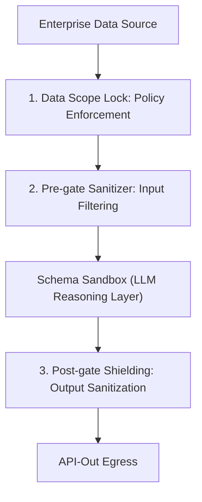

# 图式沙箱：用于受约束智能体执行的九层架构与互操作契约

**LIU TENGJIAO**  
*创始人兼研究员, psi.run*  
psi@psi.run  

---

## 摘要 (Abstract)

LLM 具有概率性，而生产环境需要确定性契约。我们提出了**图式沙箱（Schema Sandbox）**----一种介于原生大模型输出与持久化智能体执行之间的九层神经符号约束边界。我们引入了基于状态生命周期、外部副作用、数据敏感度和执行权限的 L0-L3 分类。我们进一步定义了工作分区（Workspace Partition）：它允许同一个沙箱在不混淆权限边界的前提下，编排多个 API、模型、工具和数据范围。为了实现跨智能体之间的安全组装，我们定义了用于能力发现、挂载和调用的图式互操作协议（SIP）。微观基准测试表明，在我们的评测设定下，本地校验的中位数延迟为 1.5 微秒，大幅低于远程大模型的推理延迟。本项工作为在智能体系统中强制执行可靠的边界提供了架构蓝图和互操作协议规范。

---

## 1. 引言 (Introduction)

长周期智能体的失败，往往不是因为模型本身不够聪明，而是因为缺乏清晰的边界。在单轮对话中有效的 Prompt 在经历数十个步骤的拉长后会不可避免地退化，导致格式崩溃、规则被忽视以及状态表征的统计学漂移（认知漂移）。

在构建生产级智能体系统的过程中，我们发现后置校验往往为时已晚：在大模型吐出错误的 Token 并被执行前，游戏就已经失控。我们需要的是一个根据沙箱级别和执行机制，在生成前、生成中或生成后运行的活性约束边界。

我们将此边界称为图式沙箱（Schema Sandbox）。它不是另一个记忆层包装器，而是一个将概率性的 Token 流编译为符合契约的动作的认知约束层。本项研究详细规定了其架构规范，以及用于跨智能体实现沙箱互操作性的协议。本工作探讨了介于纯提示词控制与基础设施级沙箱隔离之间的中间设计空间。

休伯特·德雷福斯（Hubert Dreyfus）对“无身体人工智能”的哲学批判表明，缺乏情境边界的系统极易发生漂移，因为它们缺乏锚定语义的情境上下文 [1]。本研究并非将德雷福斯的理论作为直接的技术模型，而是将其作为一个有益的类比：智能体的执行需要情境化的约束。在智能体系统中，这种约束是信息层面的而非物理层面的，用于限制模型的注意力、状态和允许的动作。

在我们配套发表的理论定位论文 [10] 中，我们指出为了约束认知漂移并防止智能体人格（Identity）耗散，持久的智能体人格（Agent IP）需要一个边界机制 - 即图式沙箱（Schema Sandbox）。本项研究则为此边界层提供了具体的架构规范与互操作协议。

我们的评估表明，本地图式校验引入了极低的计算延迟。在我们的基准测试中，本地沙箱拦截门仅需 1.50 微秒的执行开销，大幅低于远程大模型 API 的推理延迟。这使得在生成的每一步施加活性约束成为可能，且不降低系统吞吐性能。

本文提出了一种概念架构。具体实现细节是 psi.run 正在开发的生产系统的一部分。

本项研究提供了：
1. **形式化认知边界定义**：我们将图式沙箱形式化为围绕大模型智能体执行的输入/输出和文法约束的神经符号边界层（参见 Section 3）。
2. **九层参考架构**：我们详尽阐述了将每一层映射到特定失效模式的具体架构，同时建立了 L0-L3 光谱来分类判别沙箱实例（参见 Section 4）。
3. **工作分区模型**：我们定义了沙箱内部的分区化执行方式，使异构 API 和工具可以在各自的数据范围、凭证边界、预算和校验契约下并行工作（参见 Section 4.1）。
4. **互操作协议规范**：我们制定了图式互操作协议（SIP），规范了其发现、挂载和调用契约，并通过微观基准测试对其进行了评估（参见 Section 8）。

### 表 I：不同执行风格下的校验开销对比

| 执行机制类型 | 校验延迟开销 (p50 中位数) | 系统隔离类型 | 目标应用场景 |
| :--- | :---: | :--- | :--- |
| **本地图式沙箱拦截 (本工作)** | **1.50 微秒 (us)** | 图式与低维信息流隔离 | L1 轻量级沙箱，本地过滤器 |
| **本地进程间通信 IPC** | **500 - 2,000 微秒 (us)** | 主机内存地址隔离 | L2 本地 WASM 运行时，独立子进程 |
| **基础设施级微虚拟机 VM** | **50,000 - 300,000 微秒 (us)** | 系统内核与 Syscall 物理封锁 | L3 微虚拟机集群 (如 AWS Firecracker) |
| **底座大模型 API 推理** | **500,000 - 3,000,000 微秒 (us)** | 无隔离（单纯概率生成） | 生产级云端 API 交互 (GPT-4o/Sonnet) |

---

## 2. 背景与相关工作 (Background and Related Work)

### 2.1 约束解码 (Constrained Decoding)
自回归语言模型通过在词表上对概率分布进行采样来生成文本。约束解码通过在生成的每一步修改 Logits 分布来限制其搜索空间。诸如 Outlines [2] 和 Guidance [9] 等框架将上下文无关文法（CFG）或 JSON Schema 编译为正则表达式状态机。在第 k 步，任何不属于合法转移集合 V(valid) 的 Token i 的 Logit L_k[i] 都会被屏蔽：

L'ₖ[i] = Lₖ[i] （若 i ∈ V(valid)） 或 -∞ （若 i ∉ V(valid)）

尽管这在数学上保证了输出严格符合特定语法，但它引入了“约束税（Constraint Tax）” - 限制解码路径可能会退化模型的推理能力，并增加复杂推理任务上的语义错误率，正如近期预印本 [3] 所指出的。

这一方法与 2026 年初关于图式约束智能体记忆生成（SCG-MEM）[11] 的叙述形成了对比。后者主要在检索和记忆侧施加约束以规范数据库摄入，而图式沙箱则直接在生成和执行层施加约束，作为一个运行时的活性物理边界端而非单纯的内存包装器。

### 2.2 智能体装配架与运行时 (Agent Harnesses and Runtimes)
为了执行长周期任务，大模型通常被封装在管理状态、内存和工具调用的智能体装配架中。诸如 MemGPT (Letta) 等系统将 LLM 上下文窗口视为虚拟内存，使用分页机制管理有限的 Token 预算 [4]。Tree of Thoughts [12] 通过规划中间状态的搜索路径来结构化智能体工作流。然而，这些系统缺乏统一的认知约束模型，使得 LLM 推理与系统工具执行之间的边界大多处于权宜之计。

### 2.3 沙箱隔离与权限控制 (Sandboxing and Permissions)
传统的执行沙箱在操作系统或虚拟化级别运行。容器化技术（如 Docker）和微虚拟机（如 AWS Firecracker）负责隔离未授权的代码执行。

当智能体执行任意代码时，系统级的物理隔离是必需的。然而，在许多实际工作流中，主要的失效模式是图式违规、数据泄露或工具调用格式错误，而非恶意代码注入。对于这些场景，行级范围锁定和数据脱敏在显著降低计算成本的同时，提供了极低的延迟安全保障（1.5微秒对VM微虚拟机的50毫秒）。

### 2.4 结构化输出可靠性 (Structured Output Reliability)
仅生成语法合规的 JSON 对于企业应用来说是不够的。这些 JSON 中字段的语义正确性仍然存在很大变数。JSONSchemaBench 等基准测试表明，即使大模型在约束解码下输出了语法合规的 JSON，它们也经常无法通过语义约束（例如生成不存在的数据库 ID 或违反数值区间限制） [6]。因此，一个完整的架构除词汇约束解码外，还必须管理语义验证、输入过滤与输出脱敏。

---

## 3. 定义与主要贡献 (Definition and Contributions)

图式沙箱作为具有神经符号接口的认知边界运行：神经侧负责生成，符号侧负责拦截过滤。与监控系统调用的操作系统沙箱不同，图式沙箱专门拦截和管理大模型与环境之间的信息流。

数学上，设 M 为表示序列概率分布的语言模型。设 E 为外部环境。未受约束的智能体表现为直接循环：M ↔ E。图式沙箱引入了一个包含三个门控的约束函数 S = (C_in, C_out, G)，即输入过滤器 (C_in)、Logit 屏蔽器 (G) 和输出校验器 (C_out)：
1. C_in: I → I' 在输入进入 M 的上下文窗口之前，对其从 E 处获得的数据进行过滤与脱敏。
2. G 代表应用于 M 解码步骤的 Logit 屏蔽文法。
3. C_out: O → O' 在输出作为 API 动作派遣给 E 之前，对其进行验证与净化。

该形式化定义捕捉了大模型与外部环境之间的神经符号交互界面；而负责协调与保护该界面的内部认知层（如流程图式与权限边界）将在第 4 节中详细规定 [^1]。

---

### 3.1 与邻近概念的边界 (Boundary Against Adjacent Concepts)

图式沙箱在四个维度上与邻近的智能体设计方法不同。首先，它不是提示词模板：提示词仅仅建议行为，而沙箱约束则对照明确的契约进行强制校验。其次，它不是内存/存储系统：内存负责检索上下文，而沙箱则管控哪些上下文允许输入、哪些动作允许输出。第三，它不是操作系统级沙箱：操作系统沙箱隔离的是代码执行，而图式沙箱约束的是信息流、工具调用和结构化输出。最后，它也不是一个完整的智能体框架：它是一个可以通过 SIP 协议被各类智能体框架动态挂载的边界模块。

## 4. 图式沙箱通用九层架构 (The Nine-Layer Architecture)

成熟的图式沙箱将认知约束组织为九个逻辑层。表 II 展示了每一层所应对的失效模式、示例机制、在不同沙箱级别中的必要性以及现有技术的覆盖差距。

### 表 II：图式沙箱九层架构设计矩阵

| 架构层 | 应对的失效模式 | 示例机制 | L1 必要性 | L2 必要性 | L3 必要性 | 现有技术的覆盖差距 (Coverage Difference) |
| :--- | :--- | :--- | :---: | :---: | :---: | :--- |
| **1. Domain Corpus** | 域外幻觉、事实性错误 | 本地 Markdown、向量索引 | 可选 | 可选 | 可选 | Outlines: 仅限文法生成；无检索层支持。 |
| **2. Task Ontology** | 意图混淆、任务越界 | Pydantic 任务定义、语义契约 | 强制 | 强制 | 强制 | MemGPT: 仅管理动态内存；无本体校验。 |
| **3. Input Contract** | 进餐格式不匹配、注入 | JSON Schema 校验、类型推导 | 强制 | 强制 | 强制 | SCG-MEM: 约束记忆结构；无输入参数过滤。 |
| **4. Router** | 意图分流偏差 | 路由器、基于 Prompt 分类器 | 可选 | 强制 | 强制 | Tree of Thoughts: 侧重中间状态搜索规划；无路由边界。 |
| **5. Knowledge Selector** | 窗口溺水、注意力漂移 | BM25/向量混合检索，限制召回 | 可选 | 可选 | 可选 | Voyager: 专注于代码技能生成执行；无知识检索范围限制。 |
| **6. Procedure Schema** | 步骤跳过、陷入死循环 | 有向无环图（DAG）执行引擎 | 强制 | 强制 | 强制 | SCG-MEM: 侧重记忆状态；无 DAG 流程多步校验。 |
| **7. Tool/API Grammar** | 工具调用格式崩溃 | EBNF 语法、Logit 屏蔽 | 可选 | 强制 | 强制 | Outlines: 侧重 Token 语法约束；无执行权限控制。 |
| **8. Boundary & Permission** | 越权执行、特权提升 | WASM 运行时、子进程 IPC、cgroups| 可选 | 强制 | 强制 | 现有约束生成库：仅限于词法路径生成；无 OS 级执行防护。 |
| **9. Output Contract** | 语义泄露、格式幻觉 | 前置/后置正则审查、自愈重试 | 强制 | 强制 | 强制 | Outlines: 仅校验输出语法；无生成后的语义敏感拦截过滤。 |

图式沙箱是一个约束边界，而非检索系统。当任务指令为静态，或者底座模型已经内化了相关知识时，沙箱可以在不维护本地知识库的情况下执行校验和策略过滤。

### 4.1 工作分区与多 API 编排 (Workspace Partitions and Multi-API Orchestration)

九层架构不应被理解为围绕单一 API 的线性包装器。在生产环境中，一个沙箱往往需要同时协调多种异构能力。如果将所有外部服务与通道压缩进同一个无差别的上下文，就会产生数据泄漏、权限混淆和责任边界不清的问题。

因此，我们将工作分区（Workspace Partition）定义为图式沙箱内部逻辑隔离的受控执行单元。每个分区可以声明独立的数据输入子集、API 文法、凭证边界和预算限制。沙箱运行时的路由器将子任务分派给不同分区，通过边界与权限层阻止跨分区的数据与特权泄漏，最终由输出契约进行汇总验证。

这种分区模型使得异构服务集成（如不同模型供应商、搜索工具、数据库客户端和本地校验脚本）能够在独立的受控边界下协同运行。多 API 编排的核心在于对异构能力进行逻辑分区，以确保每次外部访问均在被审计的范围内进行。

---

## 5. 典型运行时设计模式 (Representative Runtime Design Patterns)

两类典型的运行时设计模式有助于阐明本研究所提架构的定位。

### 5.1 基础设施操作系统级（L3）隔离
正如 2026 年初关于智能体系统设计空间的预印本评述 [8] 所指出的，基于 CLI 的智能体（如 Claude Code）通过物理隔离来保障执行安全。在这些系统里，执行环境需要操作系统级别的隔离、权限控制和凭证管理：
* **查询引擎与邮箱编排**：运行时动态管理上下文压缩和 Token 预算。并发执行冲突通过“邮箱模式（Mailbox Pattern）”解决，子智能体向协调器队列提交命令提议以进行去冲突和排序。
* **虚拟化封锁**：典型的 L3 设计使用系统级隔离（如 Linux Namespaces, 控制组及系统调用过滤）来约束执行副作用。对于终端命令，可能在会话期间冷启动短暂的微型虚拟机。
* **凭证隔离**：为防止未授权代码窃取 API 密钥，高危凭证保存在沙箱之外，通过在宿主机上运行本地守护进程来实现受控签名。

### 5.2 工作空间级（L2）工具链
工作空间集成智能体（如 Cursor）依赖于轻量级的工作空间索引，而非操作系统级虚拟化隔离：
* **增量工作空间检测**：运行时利用文件级 Merkle 树跟踪文件哈希，实现毫秒级增量向量和 AST 索引，避免全量文件扫描。
* **语法树语义分块**：放弃粗暴的字符长度切割，而是通过抽象语法树（AST）将代码划分为类和函数等具有语义完整性的块。
* **按需上下文注入**：系统根据当前文件的扩展名或语义路径，动态地向 Prompt 窗口编译注入对应的规则文件（如 `.cursorrules` 或 `.cursor/rules/*.mdc`），缓解注意力发散。

---

## 6. L0-L3 图式规模光谱 (The L0-L3 Scale Spectrum)

我们发现根据 L0-L3 光谱对图式沙箱进行分类非常有用。四个判别维度定义了这一规模光谱：
1. **状态生命周期 (State Duration)**：认知约束的时间跨度（例如，单次无状态 vs. 长期有状态）。
2. **外部副作用 (External Side Effects)**：在外部环境中的写权限级别（例如，无副作用、本地 file 写、数据库写入、全局网络访问）。
3. **数据敏感度 (Data Sensitivity)**：进入上下文的最大数据安全密级（例如，公开数据、本地工作区、企业级 PII / 财务数据库）。
4. **执行权限 (Execution Authority)**：沙箱运行时的系统权限级别（例如，Logit 屏蔽、用户态进程、内核级系统调用过滤）。

表 III 展示了这四个维度下的规模光谱分类。

### 表 III：图式沙箱规模光谱分类矩阵

| 密级 | 状态生命周期 | 外部副作用 | 数据敏感度 | 执行权限 | 代表性目标 |
| :--- | :--- | :--- | :--- | :--- | :--- |
| **L0 (原子级)** | 单次交互 | 无 | 公开 / 低密级 | Logit 屏蔽 | 结构化 JSON 生成 |
| **L1 (轻量级)** | 多轮对话 | 只读 / 本地写入 | 工作空间 / 本地 | 用户态进程空间 | GEO 卡片生成、本地 Linter |
| **L2 (交互级)** | 长期交互 | 数据库/CRM 写入 | 企业级 PII / 财务数据 | 子进程 IPC / WASM 容器 | 数据库交互、Salesforce 代理 |
| **L3 (系统级)** | 无限长生命周期| 任意 Shell 执行权限 | 高危系统密钥/密码 | 内核 Seccomp 过滤 / 虚拟机 | 自主系统级程序员代理 |

在实际中，我们遇到的大多数生产级智能体工作流都属于 L1 或 L2。当真正的风险是工具调用格式崩溃和数据泄露而非任意 Shell 代码执行时，昂贵的 L3 VM 封锁隔离往往是过度设计的。在这些场景中，通过逻辑范围锁定和数据脱敏可以以更低的延迟实现所需的安全性。

---

## 7. L2 数据脱敏与范围锁定框架 (L2 Data Sanitization & Scope Lock)

对于与企业级数据库或 API 交互的 L2 沙箱，运行时在数据摄入前和输出分派前执行数据边界约束。

*图 1：L2 数据脱敏与数据库范围锁定交互流*

### 7.1 数据范围锁定 (Data Scope Lock)
沙箱在数据库连接层强制执行查询范围，限制数据查询边界，确保数据库会话限于授权的用户范围与参数化接口中。

### 7.2 冗余上下文修剪
在将数据库行数据送入 LLM 之前，沙箱修剪多余的系统元数据和内部时间戳，消除噪声并保护 Token 窗口。

### 7.3 双门控拦截脱敏 (Dual-Gate Sanitization)
* **前置脱敏门 (Pre-gate, 输入门)**：在文本传入 LLM 前，对敏感数据或密钥进行遮蔽。
* **后置审查门 (Post-gate, 输出门)**：在输出响应时，扫描生成的 payload，一旦检测到敏感信息泄露或格式违规，强制中止执行。

### 7.4 威胁模型

本框架的威胁边界定义如下。

#### 7.4.1 在边界内防御的威胁 (In-Scope)
* **提示词注入**：攻击者在输入中注入恶意指令尝试绕过系统规则。这可以通过沙箱级的执行限制和数据库级的查询参数限制来避免。
* **越权读取**：尝试绕过过滤访问非授权行。这可以通过在沙箱之外绑定受限会话凭证来解决。
* **敏感信息泄露**：模型在输出中携带了敏感凭证或个人信息。这可以通过前置输入脱敏与后置输出正则盾来拦截。
* **参数注入攻击**：攻击者诱导模型在工具调用中传入非授权文件路径或非法参数。这可以通过参数类型验证进行阻断。
* **语义违规输出**：输出满足语法结构但语义值超标或违规。这可以通过后置图式校验及区间过滤捕获。

#### 7.4.2 在边界之外的风险 (Out-of-Scope)
* **模型底层逻辑推理错误**：模型在不违反安全规则、参数类型和图式定义的前提下给出了错误的推理结论。
* **上游权限配置错误**：如果传递给沙箱的底座用户权限本身过大，沙箱在逻辑上无法检测此项配置错误。
* **宿主机本身被黑客攻破**：执行本地沙箱环境的运行节点本身遭到入侵。
* **训练数据隐式泄露**：底座大模型直接吐出了内部记忆的敏感训练样本，且该样本不符合任何已定义的特征。

## 8. 图式互操作协议 (The Schema Interoperability Protocol)

图式互操作协议（SIP）提供了一个概念性框架，用以规范自主 Agent IP 如何动态挂载与执行异构的沙箱边界。通过标准化接口契约，智能体可以组合不同的沙箱能力，而无需为每个沙箱定制专用的集成代码。

### 8.1 协议分层概念
* **图式发现协议 (Schema Discovery Protocol, SDP)**：规范运行时如何查询和定位可用的沙箱边界。
* **图式挂载协议 (Schema Mount Protocol, SMP)**：规范宿主如何将沙箱边界实例化并挂载至受控的执行接口中。
* **图式调用契约 (Schema Invocation Contract, SIC)**：规定运行时参数传递和边界执行的具体交互规范。

### 8.2 版本协商与兼容性校验
协议设计建议宿主与挂载沙箱之间进行基本的版本和能力检查，以防止运行时发生版本冲突。同时，它定义了概念性的完整性校验机制，以确保沙箱边界定义在执行前未被篡改。

## 9. 案例研究：以内容增长工作台作为 L1/L2 参考实现 (Case Study)

内容增长工作台展示了垂直领域工作流如何被封装为图式沙箱。该平台负责生成生成式引擎优化（GEO）及 AI 搜索就绪的内容资产。本案例研究旨在进行架构阐释与可行性展示，而非进行广泛的基准测试验证。

### 9.1 使用场景与核心逻辑
内容增长工作台的目标是生成结构化的数字内容（例如事实晶体、实体卡片和本地化 FAQ），以优化其在生成式搜索引擎（如 Google AI Overviews 和 Perplexity）中的引用概率。生成 AI 搜索就绪的内容需要严格遵守特定的文法约束、事实密度及信源引用规范。在多次长周期迭代下，简单的 Prompt 往往容易变得脆弱，特别是在输出必须保持事实密度、格式约束和特定品牌规则的场景下。工作台通过将领域工作流封装进本地轻量级的图式沙箱中解决了这一难题。

### 9.2 架构映射
该原型将领域工作流概念性地映射到九层架构中：
* **本体与任务校验（第 1--3 层）**：验证领域特定的内容结构与基础输入参数契约。
* **路由与知识选择（第 4 与 5 层）**：引导输入上下文的流向与模板选择。
* **流程与门控拦截（第 6--9 层）**：在轻量级的边界约束下，管理执行路径并进行基本的输出合规验证。

在规模分类上，该原型主要作为 L1 级沙箱运行，约束在本地进程校验与只读范围内。

### 9.3 与 Agent IP 的关联
在 psi.run 生态系统中，该工作台作为首个参考技能模块：持久化的 Agent IP 可以通过 SIP 协议挂载它，在明确的输入、流程和输出约束下执行专业的内容增长任务。该工作台作为设计层面的参考实现；第 10 节中的极简 Python 装配架是独立实现的，用以隔离和评估策略检查的开销。

---

## 10. 本地校验逻辑的微观基准测试 (Micro-benchmark of Local Validation Checks)

独立于内容增长工作台的案例研究，我们实现了一个极简的 Python 装配架，用以隔离和测量确定性策略检查的行为。我们评估了三种基准测试输入，分别代表常规安全输入、含有异常参数的输入以及包含策略违规特征的输出。

本地校验器仅执行基础的输入/输出过滤器与合规审查。具体的耗时数据如表 I 所示（参见 Section 1）。该原型并不调用真实的生产级 LLM，其目的在于测量确定性策略检查逻辑的计算开销，并展示在脚本化不安全场景下的控制流拦截行为。

### 10.1 校验逻辑的量化延迟基准测试
为了提供可验证的量化数据支持，我们对本地策略检查逻辑运行了 10,000 次基准测试。
* **评测硬件环境**：AMD64 Ryzen 5 5625U (Zen 3, Barcelo, 6 Cores, 12 Threads, 2.3GHz 主频) 运行单线程 Python 3.10 校验器进程 | 操作系统: Windows 11。
* **10,000 次循环测试得到的处理耗时**：
  * **平均延迟**：1.580 微秒 (us)
  * **p50 (中位数) 延迟**：1.500 微秒 (us)
  * **p90 延迟**：1.600 微秒 (us)
  * **p95 延迟**：1.700 微秒 (us)
  * **p99 延迟**：2.100 微秒 (us)

本地校验耗时约为 1.5 微秒，大模型本身的推理时间通常在 500 毫秒以上。相对于 500 毫秒的远程推理基线，这大约对应了 300,000 倍的差距。需要说明的是，这种对比主要是示意性的，而非等效隔离机制之间的直接对标。此基准测试仅测量确定性的策略执行层，不包含大模型本身的推理时间。其核心启示在于，该项开销非常小，完全可以在每次模型生成步骤中运行而不会成为性能瓶颈。

---

## 11. 局限性与未来工作 (Limitations and Future Work)

我们的当前架构和原型依然存在局限性：
1. **语义与语法偏离**：约束解码虽保障了 JSON 的数据格式，但无法验证语义事实。即使输出格式正确，内容中的具体事实陈述（如历史年份）仍然可能出错。尽管 EBNF 约束保障了语法的兼容性，但我们也必须评估在复杂推理任务上强制施加限制性正则文法是否会损害模型潜在的逻辑表现（即‘约束税’）。
2. **语义规则不完备**：输入/输出门校验仅能拦截根据规则或正则显式定义的已知不合规数据，无法防止模型自身在不违背语法规则下生成全新、无明显特征的非事实逻辑错误。
3. **策略规则需要手动编写**：目前九层架构仍然非常依赖开发者人工编写 EBNF 语法树、Pydantic 校验类和正则过滤规则。
4. **对上游授权的强依赖**：L2 数据锁定依赖于企业数据库本身的 RLS 设置，如果上游连接凭证越权，沙箱无法从逻辑上自发纠正越界。
5. **评测覆盖范围**：虽然我们对本地校验管线进行了基准测试，但大模型本身（如 Claude 3.5 Sonnet, GPT-4o）在长周期任务下的漂移抑制与任务完成率的实证评测目前仍在持续进行中。

下一阶段，我们计划将这一架构规范升级为完整的实证研究。目前正在进行的评测协议包括：
* **任务集**：构建涵盖代码生成、数据库查询合成和 API 派遣的不少于 100+ 条真实任务库。
* **模型集**：选择 2-4 个有代表性的大模型（如 Claude 3.5 Sonnet, GPT-4o, Llama-3-70B, Qwen-2.5-7B）作为底座。
* **基线对比**：对比以下四种策略下的表现：(a) 仅 Prompt 提示词约束，(b) 纯后置脚本解析器，(c) 仅 Logits 屏蔽约束解码，(d) 完整的图式沙箱框架。
* **评估指标**：量化测量六个指标：图式格式合规率 (schema validity)、语义正确率 (semantic accuracy)、高危工具拦截率 (unsafe block rate)、合规但内容错误率 (wrong-valid-schema rate)、平均运行延迟和重试自愈次数。

---

## 结论 (Conclusion)

图式沙箱识别了介于纯提示词控制与基础设施级隔离之间的中间设计空间。通过将该空间分解为九层架构和互操作协议，本文为未来受约束智能体执行的实证评估与具体实现提供了基础。

---

## 脚注 (Footnotes)

[^1]: 关于图式沙箱所处的更广泛的理论框架 - 特别是智能体具象化（Agent Concretization）、信息边界（Informational Boundaries）与后天提示词层（Epigenetic Prompt Layers）等概念，读者可参考 [10]。

---

## 致谢 (Acknowledgments)

我们在原型开发及手稿撰写过程中使用了智能体编程助手；所有学术观点及潜在错误均由作者自行承担。

---

## 参考文献 (References)

[1] Hubert Dreyfus. *What Computers Can't Do: A Critique of Artificial Reason*. Harper & Row, 1972.

[2] Brandon T. Willard and Remi Louf. "Efficient Guided Generation for Large Language Models." *arXiv preprint arXiv:2307.09702*, 2023.

[3] Jaideep Ray. "The Constraint Tax: Measuring Validity-Correctness Tradeoffs in Structured Outputs for Small Language Models." *arXiv preprint arXiv:2605.26128*, 2026. [preprint]

[4] Carter Packer, Sarah Wooders, Kevin Lin, Vivian Fang, Shishir G. Patil, Ion Stoica, and Joseph E. Gonzalez. "MemGPT: Towards LLMs as Operating Systems." *arXiv preprint arXiv:2310.08560*, 2023.

[5] Guanzhi Wang, Yuqi Xie, Yunfan Jiang, Ajay Mandlekar, Chaowei Xiao, Yuke Zhu, Linxi Fan, and Anima Anandkumar. "Voyager: An Open-Ended Embodied Agent with Open-World Curiosity and Self-Improvement." *arXiv preprint arXiv:2305.16291*, 2023.

[6] Saibo Geng, Hudson Cooper, Michal Moskal, Samuel Jenkins, Julian Berman, Nathan Ranchin, Robert West, Eric Horvitz, and Harsha Nori. "JSONSchemaBench: A Rigorous Benchmark of Structured Outputs for Language Models." *arXiv preprint arXiv:2501.10868*, 2025.

[7] Anthropic. "Claude Code Documentation." *Anthropic Developer Portal*, 2026. URL: https://code.claude.com/

[8] Jiacheng Liu, Xiaohan Zhao, Xinyi Shang, and Zhiqiang Shen. "Dive into Claude Code: The Design Space of Today's and Future AI Agent Systems." *arXiv preprint arXiv:2604.14228*, 2026. [preprint]

[9] Guidance AI Team. "Guidance: A Domain-Specific Language for Controlling Large Language Models." *GitHub Repository*, 2023. URL: https://github.com/guidance-ai/guidance

[10] Tengjiao Liu and Hongzong Si. "Agent Concretization: Informational Boundaries and Persistent Agent IP." *OSF Preprints*, 2026. DOI: 10.31219/osf.io/y4vsh

[11] Lei Zheng, Weinan Song, Daili Li, and Yanming Yang. "To Know is to Construct: Schema-Constrained Generation for Agent Memory." *arXiv preprint arXiv:2604.20117*, 2026. [preprint]

[12] Shunyu Yao, Dian Yu, Jeffrey Zhao, Izhak Shafran, Thomas L. Griffiths, Yuan Cao, and Karthik Narasimhan. "Tree of Thoughts: Deliberate Problem Solving with Large Language Models." *NeurIPS*, 2023.
