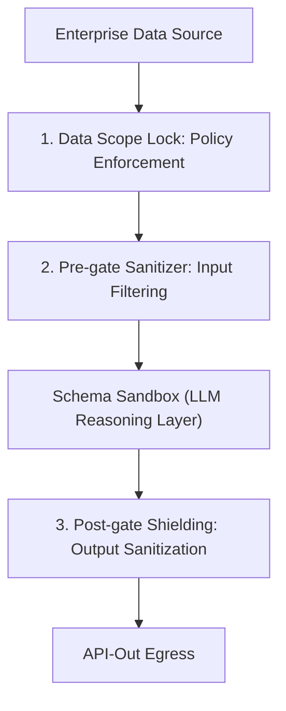

# Schema Sandbox: A Nine-Layer Architecture and Interoperability Contract for Constrained Agent Execution

**LIU TENGJIAO**  
*Founder & Researcher, psi.run*  
psi@psi.run  

---

## Abstract

LLMs generate probabilistically; production systems require deterministic contracts. We present the **Schema Sandbox**, a nine-layer neuro-symbolic constraint boundary that sits between raw LLM outputs and persistent Agent execution. We introduce an L0-L3 classification based on state duration, side effects, data sensitivity, and execution authority. We further define workspace partitions as controlled execution units that allow one sandbox to orchestrate multiple APIs, models, tools, and data scopes without collapsing their permissions into a single undifferentiated context. To enable secure composition across agents, we define the Schema Interoperability Protocol (SIP) for discovery, mounting, and invocation. Micro-benchmarks show that local validation checks run at a median of 1.5 microseconds, substantially below remote model inference latency in our measurement setting. This work provides both the architectural blueprint and the interoperability specification for enforcing reliable boundaries in agent systems.

---

## 1. Introduction

Long-horizon agents fail less because of model intelligence and more because of missing boundaries. Prompts that work for single turns degrade over dozens of steps. Formatting breaks, rules get ignored, and state drifts.

While building production agents, we found that post-hoc validation is too late. The model has already committed to a bad token before any checker runs. What we need is an active boundary that can operate before, during, or after generation, depending on the sandbox level and enforcement mechanism.

We call this boundary the Schema Sandbox. It is not another memory wrapper. It is a cognitive constraint layer that turns probabilistic token streams into contract-compliant actions. This paper specifies its architecture and the protocol for making such boundaries interoperable across agents. This work addresses an intermediate design space between prompt-only control and infrastructure-level sandboxing.

Hubert Dreyfus's philosophical critique of disembodied AI highlights the drift that occurs when systems lack situated context [1]. This critique is not used here as a direct technical model, but as a useful analogy: agency requires situated constraints. In agent systems, such constraints are informational rather than physical, bounding the attention, state, and permissible actions of the model.

In our companion position paper [10], we argued that persistent agent identity (Agent IP) requires a boundary mechanism - the Schema Sandbox - to constrain cognitive drift and prevent identity dissipation. The present work provides the architectural specification and interoperability contract for that boundary layer.

Our evaluation shows that local schema checks introduce minimal computational latency. As detailed in Table I, local sandboxing gates execute in 1.50 microseconds in our benchmark, substantially below remote model API inference latency. This allows active enforcement on every generation step without degrading system performance.

This paper presents a conceptual architecture. Implementation details are part of a production system under development in psi.run.

This paper provides:
1. **A Formal Cognitive Boundary Definition**: We formalize the Schema Sandbox as a neuro-symbolic boundary layer of input/output and grammar constraints wrapping LLM-agent execution (see Section 3).
2. **A Nine-Layer Reference Architecture**: We detail a concrete architecture mapping layers to specific failure modes, alongside an L0-L3 Scale Spectrum to categorize sandboxes by state, sensitivity, and permissions (see Section 4).
3. **A Workspace Partition Model**: We define partitioned execution inside the sandbox, allowing heterogeneous APIs and tools to run in parallel under separate data scopes, credentials, budgets, and validation contracts (see Section 4.1).
4. **An Interoperability Protocol Specification**: We specify the Schema Interoperability Protocol (SIP) governing discoverability, mounting, and invocation contracts, and evaluate it via micro-benchmarks (see Section 8).

### Table I: Latency Overhead Comparison by Execution Style

| Execution Style | Latency Overhead (p50 Median) | Isolation Type | Implementation Scope |
| :--- | :---: | :--- | :--- |
| **Local Sandbox Check (This Work)** | **1.50 us** | Schema & Information Flow | L1 Lightweight local filters |
| **Out-of-process IPC (Local)** | **500 - 2,000 us** | Host Memory Space | L2 WebAssembly/subprocess runtimes |
| **Micro-VM Containment (L3)** | **50,000 - 300,000 us** | OS Kernel & Syscalls | L3 micro-VMs (e.g., AWS Firecracker) |
| **Base LLM API Inference** | **500,000 - 3,000,000 us** | None (Stateless Query) | Base model API endpoints (GPT-4o/Sonnet) |

---

## 2. Background and Related Work

Our work intersects with several active areas of research in structured generation, agent runtimes, and execution security.

### 2.1 Constrained Decoding
Autoregressive language models generate text by sampling from a probability distribution over a vocabulary. Constrained decoding restricts this search space by modifying the logit distribution at each step of generation. Frameworks like Outlines [2] and Guidance [9] compile context-free grammars (CFGs) or JSON schemas into regular expression state machines or prefix-tries. At step k, the logit L_k[i] for any token i not belonging to the set of valid transitions V(valid) is masked:

L'ₖ[i] = Lₖ[i] (if i ∈ V(valid)) or -∞ (if i ∉ V(valid))

While this mathematically guarantees that the output strictly conforms to a specified syntax, it introduces a "constraint tax" - wherein restricting the decoding path can degrade the model's reasoning capabilities and increase semantic error rates on complex tasks, as reported in recent preprints [3]. 

This approach contrasts with the method described in early 2026 preprints on Schema-Constrained Generation for Agent Memory (SCG-MEM) [11], which applies constraints primarily at the retrieval/memory layer to structure database ingestion. In contrast, the Schema Sandbox enforces constraints directly at the generation and execution layer, operating as an active runtime boundary rather than a memory wrapper.

### 2.2 Agent Harnesses and Runtimes
To execute long-horizon tasks, models are wrapped in agent harnesses that manage state, memory, and tool calls. Systems like MemGPT (Letta) treat LLM context windows as virtual memory, using paging to manage finite token budgets [4]. Tree of Thoughts [12] structures agent workflows by planning search paths through intermediate states. However, these harnesses lack a unified cognitive constraint model, leaving the boundary between LLM reasoning and system tool execution largely ad-hoc.

### 2.3 Sandboxing and Permissions
Traditional execution sandboxing operates at the operating system or virtualization level. Containerization (e.g., Docker) and micro-virtual machines (e.g., AWS Firecracker) isolate untrusted code execution. 

Infrastructure-level isolation is necessary when agents execute arbitrary code. But in many workflows, the dominant failure modes are schema violations, data leakage, or malformed tool calls--not code injection. For these cases, logical scope locks and data sanitization provide safety at low latency (1.5 us vs. 50 ms for micro-VMs).

### 2.4 Structured Output Reliability
Generating syntactically valid JSON is insufficient for enterprise applications. The semantic correctness of fields within that JSON remains highly variable. Benchmarks like JSONSchemaBench show that even when models output valid JSON structures under constrained decoding, they frequently fail semantic constraints (e.g., generating invalid database IDs or violating value range restrictions) [6]. A comprehensive architecture must therefore govern semantic validation, input filtering, and output sanitization in addition to lexical decoding constraints.

---

## 3. Definition of the Schema Sandbox

The Schema Sandbox operates as a cognitive boundary with a neuro-symbolic interface: the neural side generates, the symbolic side gates. Unlike an operating system sandbox that monitors system calls, a Schema Sandbox gates the information flow between the LLM and the environment.

Mathematically, let M be a language model representing a probability distribution over sequences. Let E be an external environment. An unconstrained agent behaves as a direct loop: M ↔ E. The Schema Sandbox wraps an LLM with three gates: input filter (C_in), logit mask (G), and output validator (C_out):
1. C_in: I → I' filters and sanitizes inputs from E before they enter M's context.
2. G represents the logit-masking grammar applied to the decoding step of M.
3. C_out: O → O' validates and sanitizes outputs from M before they are dispatched as API actions to E.

This formalization captures the neuro-symbolic interface between the model and the environment; the internal cognitive layers (such as the procedure schema and permission boundaries) that coordinate and secure this interface are specified in Section 4 [^1].

---

### 3.1 Boundary Against Adjacent Concepts

A Schema Sandbox differs from adjacent approaches in four ways. It is not a prompt template: prompts suggest behavior, while sandbox constraints are checked against explicit contracts. It is not a memory system: memory retrieves context, while the sandbox governs what context may enter and what actions may leave. It is not an operating-system sandbox: OS sandboxes isolate code execution, while Schema Sandboxes constrain information flow, tool calls, and structured outputs. It is also not a full agent framework: it is a boundary module that can be mounted by agent frameworks.

## 4. The Nine-Layer Architecture

A Schema Sandbox organizes constraints into nine logical layers. Table II shows how each layer addresses a concrete failure mode, alongside its requirements across scale spectrum levels and coverage differences against prior art.

### Table II: The Nine-Layer Schema Sandbox Architecture

| Layer | Failure Mode | Example Mechanism | L1 | L2 | L3 | Coverage Difference |
| :--- | :--- | :--- | :---: | :---: | :---: | :--- |
| **1. Domain Corpus** | Out-of-domain hallucinations | Vector indices, local markdown guides | Opt | Opt | Opt | Outlines: grammar only; no retrieval. |
| **2. Task Ontology** | Intent confusion | Pydantic task definitions, semantic schemas | Mand | Mand | Mand | MemGPT: dynamic memory; no ontology validation. |
| **3. Input Contract** | Malformed input ingestion | JSON Schema validation, type checking | Mand | Mand | Mand | SCG-MEM: memory formatting; no input gating. |
| **4. Router** | Sub-task routing misalignment | Semantic router, prompt-based classifier | Opt | Mand | Mand | Tree of Thoughts: state path planning; no routing boundaries. |
| **5. Knowledge Selector** | Context window drowning | Hybrid BM25/Vector retrieval, max 8 units | Opt | Opt | Opt | Voyager: skill execution; no knowledge retrieval limits. |
| **6. Procedure Schema** | Step skipping, execution drift | Deterministic DAG execution engines | Mand | Mand | Mand | SCG-MEM: state constraints; no DAG procedure checks. |
| **7. Tool/API Grammar** | Invalid tool formatting | EBNF grammars, logit masking | Opt | Mand | Mand | Outlines: token syntax; no permission gating. |
| **8. Boundary & Permission** | Privilege escalation | WASM runtimes, sub-process IPC, cgroups | Opt | Mand | Mand | Standard libraries: lexical constraints; no OS execution security. |
| **9. Output Contract** | Post-parsing errors, leaks | Pre/Post-gate regex, self-healing retries | Mand | Mand | Mand | Outlines: output syntax; no post-generation semantic leakage filters. |

The Schema Sandbox is a constraint boundary, not a retrieval system. When task instructions are static, or when the base model already internalizes the relevant knowledge, the sandbox validates and gates execution without a local knowledge repository.

### 4.1 Workspace Partitions and Multi-API Orchestration

The nine layers should not be interpreted as a single linear wrapper around a single API. In production settings, a sandbox often needs to coordinate multiple heterogeneous capabilities. If all external services and channels are compressed into a single undifferentiated context, it creates unnecessary data leakage and privilege confusion.

We therefore define workspace partitioning as a conceptual logical division of execution contexts within the sandbox. Each partition operates under restricted permissions, budgets, and interface grammars. The orchestrating runtime coordinates task execution across these partitioned boundaries, preventing credential leakage and privilege escalation while consolidating their respective outputs.

This partition model allows heterogeneous service integrations (such as model providers, search tools, database clients, and local validation scripts) to execute under distinct security boundaries. Multi-API orchestration is governed through logical partitioning rather than simple service composition, ensuring each external access occurs within a verified scope.

---

## 5. Representative Runtime Design Patterns

Two representative runtime patterns help situate the proposed architecture.

### 5.1 Infrastructure OS-Level (L3) Isolation
As reported in early 2026 preprints on the design space of today's agent systems [8], CLI-based agents like Claude Code manage execution safety through physical containment. In these systems, execution environments require OS-level containment, permission gating, and credential isolation:
* **Query Engine and Mailbox Orchestration**: Runtimes manage context compaction and token budgeting dynamically. Parallel execution conflicts are resolved via mailbox patterns where sub-agents submit command proposals to a coordinator queue.
* **Virtualized Isolation**: Representative L3 designs contain side effects using system virtualization (such as Linux namespaces, control groups, and system call filtering). For terminal execution, transient micro-VMs may be spawned and destroyed session-by-session.
* **Credential Gateways**: To prevent untrusted code from stealing API keys, high-privilege credentials reside outside the containment zone; requests requiring credential access are signed via a local daemon running on the host system.

### 5.2 Workspace-Level (L2) Tooling
Workspace-integrated agents (such as Cursor) rely on lightweight workspace indexing rather than OS virtualization:
* **Incremental Workspace Indexing**: Runtimes track changes via file-level Merkle trees, triggering incremental vector and AST indexes without expensive full-directory scans.
* **Syntax-Aware Chunking**: Rather than relying on character-count splits, code is parsed into Abstract Syntax Tree (AST) blocks to preserve semantic boundaries (e.g., class and method boundaries).
* **Targeted Context Compaction**: Rules files (e.g., `.cursorrules` or `.cursor/rules/*.mdc`) are conditionally compiled and injected into the active prompt context based on file extensions or directory paths, mitigating attention drift.

---

## 6. The L0-L3 Scale Spectrum

We found it useful to classify Schema Sandboxes along an L0-L3 spectrum. Four discrimination dimensions govern this spectrum:
1. **State Duration**: The temporal span of cognitive constraints (e.g., single-turn stateless vs. long-horizon stateful).
2. **External Side Effects**: The level of write authorization in the external environment (e.g., read-only, local file writes, database writes, global internet access).
3. **Data Sensitivity**: The maximum classification of data entering the context window (e.g., public data, localized workspace, enterprise PII/financial databases).
4. **Execution Authority**: The privileges of the sandbox runtime (e.g., logit masking, user-space execution, kernel-level syscall filtering).

Table III maps the scale spectrum using these four dimensions.

### Table III: Sandbox Scale Spectrum Classification

| Class | State Duration | External Side Effects | Data Sensitivity | Execution Authority | Representative Target |
| :--- | :--- | :--- | :--- | :--- | :--- |
| **L0 (Atomic)** | Single-turn | None | Public / Low | Logit Masking | Structured JSON generation |
| **L1 (Lightweight)** | Multi-turn | Read-only / Local | Workspace / Local | User-Space Process | GEO card generator, local linters |
| **L2 (Interactive)** | Long-horizon | CRM, Database writes | Enterprise PII, Financial | Subprocess IPC / WASM | SQL client, Salesforce agent |
| **L3 (Infrastructure)** | Infinite | Arbitrary shell writes | High-privilege keys | Kernel `seccomp` / VM | Autonomous terminal developers |

In practice, most production agent workflows we encounter fall into L1 or L2. The expensive L3 containment is often overkill when the real risks are malformed tool calls and data leakage rather than arbitrary code execution. Safety can be enforced at much lower latency through logical scope locks and data sanitization.

---

## 7. L2 Data Sanitization & Scope Lock Specification

For L2 sandboxes interacting with corporate databases or APIs, the runtime enforces data boundaries before ingestion and output dispatch.

*Figure 1: L2 Data Sanitization and Scope Lock Flow.*

### 7.1 Data Scope Lock
The sandbox enforces query bounds at the client layer, ensuring database sessions remain confined to authorized user scopes and parameterized parameters.

### 7.2 Context Trimming
Redundant system metadata, logs, and internal timestamps are stripped prior to ingestion to minimize attention drift and token usage.

### 7.3 Dual-Gate Sanitization
* **Pre-gate Input Filter**: High-risk sensitive records or keys are masked before entering the active context window.
* **Post-gate Output Shield**: Output token streams are inspected for leaked properties or structural violations before environmental dispatch.

### 7.4 Threat Model

The threat boundary of the data sanitization framework is structured as follows.

#### 7.4.1 In-Scope Threats (Mitigated)
* **Prompt Injection**: Unintended instructions embedded within user inputs attempting to bypass system rules. Mitigated by sandbox-level execution restrictions and database-level query constraints.
* **Unauthorized Data Access**: Attempts to query records outside the active user scope. Mitigated by session-bound client credentials managed outside the LLM context.
* **Sensitive Data Leakage**: Accidental output of credentials or private details. Mitigated by dual-gate input/output filters.
* **Tool-Call Parameter Injection**: Inducing malformed parameters or system path traversal. Mitigated by parameter type validation.
* **Semantic Rule Violations**: Outputs that are syntactically valid but violate domain policies. Mitigated by semantic checkers and range validation.

#### 7.4.2 Out-of-Scope Risks (Not Addressed)
* **Base Model Semantic Reasoning Failures**: The model making incorrect logical deductions that do not violate syntax, schema, or safety rules.
* **Misconfigured Upstream RBAC Permissions**: If the database user token supplied to the sandbox is over-privileged, the sandbox cannot detect authorization errors.
* **Malicious System Administrators**: Compromise of the host executing the local sandbox.
* **Training Data Leakage**: The base model outputting memorized training data that does not trigger regex or entropy thresholds.

---

## 8. The Schema Interoperability Protocol (SIP)

The Schema Interoperability Protocol (SIP) governs how autonomous Agent IPs load and execute heterogeneous capabilities. Without a common mounting and invocation contract, every agent ends up with its own ad-hoc way of loading constraints. SIP exists so that Agent IPs can compose and discover capabilities without custom glue code for every new sandbox.

### 8.1 Protocol Layers
* **Schema Discovery Protocol (SDP)**: Governs how runtimes query and locate available sandbox capabilities.
* **Schema Mount Protocol (SMP)**: Defines how runtimes instantiate the sandbox boundary within host-defined execution interfaces.
* **Schema Invocation Contract (SIC)**: Establishes the parameters and runtime boundaries for execution.

### 8.2 Version Negotiation and Compatibility
The protocol outlines basic version and capability checks between the host and the mounted sandbox to prevent runtime mismatch errors. It also suggests integrity verification mechanisms to ensure that boundary definitions remain unmodified prior to execution.

---

## 9. Case Study: Content Growth Workbench as an L1/L2 Reference Implementation

The Content Growth Workbench shows how a vertical domain workflow is packaged as a Schema Sandbox. The platform generates Generative Engine Optimization (GEO) and AI-search-ready content assets. This case study serves as an architectural illustration rather than an empirical benchmark.

### 9.1 Use Case and Core Logic
The Content Growth Workbench targets the production of structured digital content (e.g., Fact Crystals, Entity Cards, and localized FAQs) optimized for citation by Generative Search Engines (such as Google AI Overviews and Perplexity). Generating AI-search-ready content requires adhering to strict styling constraints, factual density, and citation guidelines. Simple prompts often become brittle under repeated long-horizon iterations, especially when outputs must preserve factual density, formatting constraints, and brand-specific rules. The workbench resolves this by packaging the domain workflow into an active, local-first Schema Sandbox.

### 9.2 Architecture Mapping
We implemented a GEO/content diagnosis sandbox prototype mapping the domain workflow to the nine-layer architecture:
* **Ontology and Task Validation (Layers 1--3)**: Verifies domain-specific content structures and basic input parameter contracts.
* **Routing and Selection (Layers 4 & 5)**: Guides the input context routing and template selection.
* **Procedure and Gating (Layers 6--9)**: Governs execution paths and output verification under lightweight boundary constraints.

In terms of classification, the prototype operates as an L1 sandbox, validating local properties and read-only scopes.

### 9.3 Agent IP Relevance
In the psi.run ecosystem, the workbench functions as a first reference skill module: a persistent Agent IP can mount it through SIP to perform a professional content-growth task under explicit input, procedure, and output constraints. While the Content Growth Workbench serves as a design-level reference implementation, the minimal Python harness described in Section 10 was implemented separately to isolate and evaluate policy-check overhead.

---

## 10. Micro-benchmark of Local Validation Checks

Separately from the Content Growth Workbench case study, we implemented a minimal Python harness to isolate and measure deterministic policy-check behavior. We evaluated the execution under three baseline test inputs representing safe inputs, malformed input parameters, and simulated response policy violations.

The local validator executed simple prefix filters and output verification checks. Performance metrics are reported in Table I (see Section 1). This prototype does not invoke a production LLM. It measures deterministic policy-check overhead and demonstrates control-flow behavior under scripted unsafe scenarios.

### 10.1 Quantitative Latency Evaluation
To establish empirical baseline data, we executed a micro-benchmark running the local policy check logic over 10,000 runs.
* **Evaluation Hardware**: AMD64 Ryzen 5 5625U (Zen 3, Barcelo, 6 Cores, 12 Threads, 2.3GHz base clock) running a single-threaded Python 3.10 validator process on Windows 11.
* **Measured Latency Over 10,000 iterations**:
  * **Mean Latency**: 1.580 us
  * **p50 (Median) Latency**: 1.500 us
  * **p90 Latency**: 1.600 us
  * **p95 Latency**: 1.700 us
  * **p99 Latency**: 2.100 us

Local checks cost 1.5 us. Model inference costs 500 ms. Relative to a 500 ms remote inference baseline, this corresponds to an approximate 300,000x difference. This comparison is illustrative rather than a comparison of equivalent isolation mechanisms. This benchmark measures only the deterministic policy enforcement layer. It does not include LLM inference time. The key takeaway is that the overhead is small enough to run on every generation step without becoming a bottleneck.

---

## 11. Limitations and Future Work

Our current architecture and prototype demonstrate several limitations:
1. **Semantic-Syntax Gap**: Constrained decoding guarantees syntax (e.g., valid JSON) but not semantic truth. If a model outputs a structurally valid JSON card containing incorrect historical dates, the logit-masking layer will not catch it. While EBNF constraints guarantee syntactic compatibility, we must evaluate whether enforcing restrictive regular grammars on complex reasoning tasks impairs the model's latent logical performance (the 'Constraint Tax').
2. **Semantic Validator Incompleteness**: The semantic validator (pre-gate and post-gate checks) is not complete. It can only intercept semantic errors or safety violations that are explicitly defined by developer rules and regular expressions; it cannot detect or prevent novel, open-world factual errors or reasoning mistakes made by the base model.
3. **Manual Schema Authoring**: The nine-layer architecture requires developers to manually construct EBNF grammars, Pydantic schemas, and regular expression whitelists.
4. **Upstream Credential Dependencies**: The Data Scope Lock relies on robust upstream database permissions. If row-level security policies are poorly configured, the sandbox cannot prevent data leaks.
5. **Evaluation Scope**: While we benchmarked local check latencies, full empirical evaluation of cognitive drift reduction on production models (e.g., Claude 3.5 Sonnet, GPT-4o) is ongoing.

Next, we plan to transition this architectural specification into a full empirical study. The ongoing benchmarking protocol includes:
* **Tasks**: A minimum of 100+ tasks spanning diverse domains (code generation, database query synthesis, API execution).
* **Models**: Evaluation across 2-4 representative LLMs (e.g., Claude 3.5 Sonnet, GPT-4o, Llama-3-70B, Qwen-2.5-7B).
* **Baselines**: Comparison against four baselines: (a) prompt-only instructions, (b) post-hoc programmatic validation, (c) constrained decoding (logit masking only), and (d) the full Schema Sandbox.
* **Metrics**: Measurement of six variables: schema validity, semantic accuracy, unsafe tool-call block rate, wrong-valid-schema rate, average execution latency, and retry counts.

---

## Conclusion

Schema Sandbox identifies an intermediate design space between prompt-only control and infrastructure-level isolation. By decomposing this space into a nine-layer architecture and an interoperability protocol, the paper provides a basis for future empirical evaluation and implementation of constrained agent execution.

---

## Footnotes

[^1]: For the broader theoretical framework within which the Schema Sandbox operates - specifically the concepts of Agent Concretization, Informational Boundaries, and Epigenetic Prompt Layers - the reader is referred to [10].

---

## Acknowledgments

We used agentic coding assistants during prototyping and manuscript preparation; all claims and errors remain the authors' responsibility.

---

## References

[1] Hubert Dreyfus. *What Computers Can't Do: A Critique of Artificial Reason*. Harper & Row, 1972.

[2] Brandon T. Willard and Remi Louf. "Efficient Guided Generation for Large Language Models." *arXiv preprint arXiv:2307.09702*, 2023.

[3] Jaideep Ray. "The Constraint Tax: Measuring Validity-Correctness Tradeoffs in Structured Outputs for Small Language Models." *arXiv preprint arXiv:2605.26128*, 2026. [preprint]

[4] Carter Packer, Sarah Wooders, Kevin Lin, Vivian Fang, Shishir G. Patil, Ion Stoica, and Joseph E. Gonzalez. "MemGPT: Towards LLMs as Operating Systems." *arXiv preprint arXiv:2310.08560*, 2023.

[5] Guanzhi Wang, Yuqi Xie, Yunfan Jiang, Ajay Mandlekar, Chaowei Xiao, Yuke Zhu, Linxi Fan, and Anima Anandkumar. "Voyager: An Open-Ended Embodied Agent with Open-World Curiosity and Self-Improvement." *arXiv preprint arXiv:2305.16291*, 2023.

[6] Saibo Geng, Hudson Cooper, Michal Moskal, Samuel Jenkins, Julian Berman, Nathan Ranchin, Robert West, Eric Horvitz, and Harsha Nori. "JSONSchemaBench: A Rigorous Benchmark of Structured Outputs for Language Models." *arXiv preprint arXiv:2501.10868*, 2025.

[7] Anthropic. "Claude Code Documentation." *Anthropic Developer Portal*, 2026. URL: https://code.claude.com/

[8] Jiacheng Liu, Xiaohan Zhao, Xinyi Shang, and Zhiqiang Shen. "Dive into Claude Code: The Design Space of Today's and Future AI Agent Systems." *arXiv preprint arXiv:2604.14228*, 2026. [preprint]

[9] Guidance AI Team. "Guidance: A Domain-Specific Language for Controlling Large Language Models." *GitHub Repository*, 2023. URL: https://github.com/guidance-ai/guidance

[10] Tengjiao Liu and Hongzong Si. "Agent Concretization: Informational Boundaries and Persistent Agent IP." *OSF Preprints*, 2026. DOI: 10.31219/osf.io/y4vsh

[11] Lei Zheng, Weinan Song, Daili Li, and Yanming Yang. "To Know is to Construct: Schema-Constrained Generation for Agent Memory." *arXiv preprint arXiv:2604.20117*, 2026. [preprint]

[12] Shunyu Yao, Dian Yu, Jeffrey Zhao, Izhak Shafran, Thomas L. Griffiths, Yuan Cao, and Karthik Narasimhan. "Tree of Thoughts: Deliberate Problem Solving with Large Language Models." *NeurIPS*, 2023.
